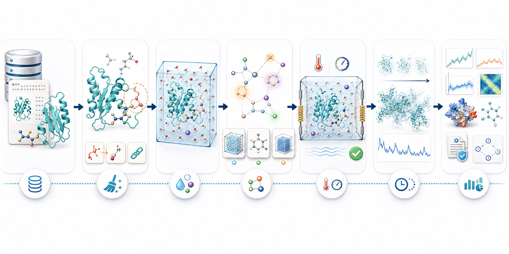

<p align="center">
  
</p>

# MDClaw

MDClaw provides skills and CLIs for vibe-MD (Molecular Dynamics) simulations and autonomous
scientific investigation in the Amber/OpenMM ecosystem. It helps an AI agent
turn scientific intent into reproducible atomistic work: prepare systems, run
equilibration and production MD, analyze trajectories, branch hypotheses, and
package evidence with provenance.

## What MDClaw Can Do

- Turn a scientific question into a study plan with observables and
  decision criteria, then run the planned MD jobs end-to-end.
- Prepare MD systems from PDB IDs, AlphaFold/UniProt entries, or local
  structure files.
- Generate monomer conformational source ensembles from MD surrogate models
  such as BioEmu, then hand selected candidates to the standard MD workflow.
- Start from a study-level scientific question, translate it into a small MD
  plan, then organize one or more job DAGs under that study.
- Inspect chains, ligands, waters, ions, glycans, DNA/RNA, and modified
  residues before committing to a setup.
- Clean structures, preserve selected ligands when safe, solvate systems, and
  assign Amber/OpenMM force fields.
- Build OpenMM-ready topology artifacts, then run equilibration and production
  MD with restartable state files.
- Branch workflows for mutations, PTMs, ligand choices, solvent models,
  temperatures, seeds, and protocols.
- Run locally, through containers, or on SLURM/HPC systems.
- Analyze trajectories and package reproducible evidence, provenance, figures,
  and Methods-style reports.
- Evaluate MD agents with the included MDPrepBench / MDStudyBench datasets and scorer.

MDClaw is split into two things that are deployed together but should be
understood separately:

| Layer | What It Is | Main Files |
|---|---|---|
| Skill layer | Agent-facing MD decision policy and procedures | `skills/`, `.agents/skills/`, `.claude/skills/` |
| MD runtime | The scientific software stack and CLI that perform the work | `bin/mdclaw`, `mdclaw/`, `container/`, `hooks/` |

The skills are text and are portable across agent harnesses. The MD runtime is
the packaged scientific stack behind the CLI: a conda environment,
Singularity/Apptainer SIF, Docker image, or local editable install.

## Install / Deploy

Choose the path that matches your agent. After installation, run
`scripts/mdclaw-doctor.sh` when using a repo checkout; it checks the runtime,
OpenMM, AmberTools, container availability, and skill discovery.

### Claude Code Plugin

Use this when you want `/mdclaw:*` slash commands and plugin-managed runtime
setup.

```text
/plugin marketplace add matsunagalab/mdclaw
/plugin install mdclaw@mdclaw
```

The plugin provides:

- `.claude-plugin/`: marketplace metadata.
- `hooks/hooks.json`: SessionStart hook that prepares the packaged MD runtime.
- `bin/mdclaw`: runtime wrapper that chooses conda, SIF, or Docker.
- `skills/`: the same MDClaw skills used by other agents.

The plugin prepares the container runtime on first session start. On HPC it
prefers a SIF for Singularity/Apptainer; on desktop it can use Docker. This is
only the execution environment for `mdclaw <tool>`; skill discovery remains the
same text files under `skills/`.

### Pi

Pi reads skills from the repository package metadata:

```bash
pi install git:github.com/matsunagalab/mdclaw@main
```

`package.json` points Pi at `./skills`. You still need one MD runtime:
the `mdclaw` conda env, a SIF through `MDCLAW_SIF`, Docker through
`MDCLAW_DOCKER_IMAGE`, or the plugin/container wrapper.

### Claude Code, Codex, OpenCode, and Generic Agents

Use this path when an agent discovers skills from repo-local skill mirrors.

```bash
git clone https://github.com/matsunagalab/mdclaw
cd mdclaw
scripts/install-agent-skills.sh
scripts/mdclaw-doctor.sh
```

`scripts/install-agent-skills.sh` creates `.agents/skills/<name>` and
`.claude/skills/<name>` symlinks to `skills/<name>`. Use
`scripts/install-agent-skills.sh --copy` if your agent or filesystem does not
follow symlinks.

Repo-local Claude Code uses `.claude/skills/` for skill discovery. The older
repo-local short commands such as `/md-prepare` are intentionally not tracked;
use the discovered skills directly, or install the Claude plugin when you want
the plugin command namespace such as `/mdclaw:md-prepare`.

### Local Runtime

For development or non-plugin usage, create the conda environment:

```bash
conda env create -f environment.yml
conda activate mdclaw
pip install -e .
mdclaw --list
```

`bin/mdclaw` chooses a runtime in this order:

1. `MDCLAW_RUNTIME=conda|singularity|apptainer|docker`, if set.
2. A conda env named `mdclaw`, if available.
3. Singularity/Apptainer with `MDCLAW_SIF` or an auto-downloaded SIF.
4. Docker image `ghcr.io/matsunagalab/mdclaw:<version-or-latest>`.
5. A local `mdclaw` on `PATH`.

See `docs/agents/deployment.md` for the full deployment matrix and
`docs/developer/container.md` for container details.

### MD Surrogate Sources

BioEmu can be used as a surrogate source generator for monomer conformational
ensembles. BioEmu is installed in an isolated venv, not in the conda `mdclaw`
environment:

```bash
mdclaw setup_surrogate_backend --model bioemu --device cuda
mdclaw check_surrogate_backend --model bioemu
mdclaw generate_surrogate_candidates \
  --model bioemu \
  --amino-acid-sequence YYDPETGTWY \
  --num-samples 100 \
  --max-candidates 20 \
  --job-dir <job_dir> \
  --node-id source_001
```

The generated candidates are recorded in the source node's `source_bundle.json`
with `source_type="surrogate"` and can be consumed by
`prepare_complex --source-candidate-id candidate_NNN`.

## Ask In Plain Language

Users do not need to remember command names. The framing of your request
decides how far MDClaw goes — three patterns:

**Plan only.** Ask the agent to plan a study. It records a lightweight
`study_plan.json` (question, MD goal, planned jobs, observables, decision
criteria) and stops so you can review before any system is built.

```text
Plan an MD study for the PSD-95 PDZ3 domain bound to the CRIPT peptide
(PDB 1BE9). Test whether the H372A mutation weakens dynamic coupling between
the distal alpha-3 helix and the peptide-binding groove. Define the WT and
mutant jobs, peptide-contact and groove-dynamics observables, and decision
criteria.
```

**End-to-end.** Ask the agent to take the scientific question all the way to
MD. It plans the study, then runs the planned jobs through preparation,
equilibration, production, and analysis.

```text
Set up and run an apo-vs-holo MD study for the T4 lysozyme L99A
benzene-binding cavity (benzene-bound PDB 4W53). Test whether benzene
occupancy stabilizes the engineered hydrophobic cavity. Plan the minimal
job set, then prepare, equilibrate, run 50 ns of production per job, and
analyze cavity hydration and ligand-pose observables.
```

**Direct one-system run.** Skip the scientific framing and ask for a single
MD run. MDClaw takes the fast path with a thin study record (one
`jobs/main`).

```text
Prepare PDB 1AKE chain A as a protein-only explicit-water system using the
default force field and water model. Continue through default equilibration,
run 10 ns of production MD, and analyze RMSD, RMSF, and energy stability.
```

Good prompts for **planning** state the scientific question, comparison
groups, and what evidence would answer the question. Good prompts for
**end-to-end runs** add a production length, replicate count, and the
observables that decide the outcome. Good prompts for **direct runs**
specify the structure source, molecular selection, solvent model, force
field, runtime target, duration, ensemble, stopping policy, and desired
evidence.

## Example Scientific Use Cases

Three reference studies chosen to exercise distinct parts of MDClaw —
ligand and cofactor handling, the PTM workflow, and membrane setup — while
answering a concrete scientific question. The KRAS study is the recommended
starting point; the others extend into deeper feature areas.

### 1. KRAS switch dynamics: wild type versus oncogenic mutants

**Question.** Does the G12C mutation reshape the switch II pocket and
destabilize switch I/II relative to wild type in the GTP/Mg²⁺-bound state?

**Why MD.** Static crystal and AI-predicted structures do not capture the
switch loop ensemble or the transient cryptic pocket targeted by clinical
KRAS-G12C inhibitors (sotorasib, adagrasib).

**MDClaw features exercised.** Ligand and cofactor parametrization
(GTP analog, Mg²⁺), branched preparation for WT / G12C / G12D from one
source bundle, modest system size (~170 residues, explicit water,
500 ns – 1 µs per branch).

```text
Set up and run a branched MD study of KRAS in the GTP-Mg²⁺ bound state.
Compare wild type, G12C, and G12D starting from a wild-type GTP-analog
KRAS structure (e.g., PDB 5VQ8, or use Boltz-2 to generate the active
state). Run 500 ns per branch and report switch I and switch II RMSF,
switch II pocket volume, and Mg²⁺ coordination stability.
```

### 2. ERK2 activation loop phosphorylation

**Question.** How does mono- (pT185) and dual (pT185 + pY187) phosphorylation
of the ERK2 activation loop reorganize the salt-bridge network around the
DFG motif and αC helix?

**Why MD.** AI structure prediction does not place phosphate-mediated
electrostatic networks reliably, and the activation-loop ensemble around the
phosphosites is intrinsically dynamic.

**MDClaw features exercised.** End-to-end PTM workflow (SEP/TPO detection
during structure preparation, branched re-application via
`phosphorylate_residues`, phosaa auto-load in `build_amber_system`),
branched preparation for apo / mono-phospho / di-phospho from one source,
~360 residues, 500 ns sufficient for local rearrangement.

```text
Set up and run an MD study comparing apo, mono-phosphorylated (pT185), and
dual-phosphorylated (pT185 + pY187) ERK2 starting from PDB 2ERK. Run 500 ns
per branch and report activation-loop salt-bridge occupancies, αC-helix
displacement, and DFG dihedral distributions.
```

### 3. β2AR ligand-class comparison in a POPC bilayer

**Question.** How do agonist, inverse agonist, and antagonist binding shape
the conformational ensemble of the β2-adrenergic receptor — TM6 outward
motion, ionic-lock state, and intracellular cavity opening?

**Why MD.** GPCR allostery is the textbook MD problem; ligand-class effects
on receptor dynamics cannot be inferred from holo structures alone.

**MDClaw features exercised.** Membrane setup via packmol-memgen (lipid21
POPC bilayer), small-molecule GAFF parametrization for multiple ligands,
Boltz-2 holo-complex prediction validated by MD, branched preparation across
ligand classes. Largest of the three studies (~80–100 k atoms) and exercises
HMR + µs production.

```text
Set up and run an MD study of β2-adrenergic receptor embedded in a POPC
bilayer. Compare apo, isoproterenol-bound (agonist), carazolol-bound
(inverse agonist), and ICI-118,551-bound (antagonist), starting from
PDB 2RH1 and using Boltz-2 to generate ligand-bound poses where needed.
Run 1 µs per branch with HMR and report TM6 outward displacement,
ionic-lock occupancy, and intracellular cavity volume.
```

## Repository Map

| Path | Role |
|---|---|
| `skills/` | Portable MDClaw skills. This is the source of truth for skill behavior. |
| `.agents/skills/` | Generic Agent Skills discovery entries, symlinked to `skills/`. |
| `.claude/skills/` | Repo-local Claude Code skill discovery entries, symlinked to `skills/`. |
| `.claude-plugin/` | Claude plugin marketplace metadata. |
| `hooks/` | Plugin lifecycle hooks, including packaged runtime setup. |
| `bin/mdclaw` | Runtime wrapper used by plugin and local deployments. |
| `mdclaw/` | Python package and CLI tool implementations. |
| `container/` | Docker image and Singularity/Apptainer SIF build assets for the packaged MD runtime. |
| `benchmarks/mdprepbench/` | Preparation workflow benchmark tasks and scorer contracts. |
| `benchmarks/mdstudybench/` | Scientific question and study-bundle benchmark tasks. |
| `docs/agents/` | Deployment notes for agent harnesses. |
| `docs/developer/` | Architecture, CLI internals, testing, release, and tool references. |
| `tests/` | Unit, smoke, benchmark, and integration tests. |

## Workflow DAG

Internally, each MD job is represented as a workflow DAG. This is the technical
contract that lets agents resume work, branch variants, and report exactly
which artifacts were used.



The main path is:

```text
study question -> MD study plan -> source bundle -> select + prepare -> solvate -> topology / force field -> equilibrate -> production MD -> analyze / evidence
```

A study is the outer record for the scientific question. It may contain one
job, such as `jobs/main`, or many jobs for WT versus mutant, apo versus holo,
or protocol comparisons. Inside each job, the `source` node records a source
bundle. A bundle can contain one structure or multiple candidate structures,
such as NMR models, PDB assembly choices, or generated prediction ensembles.
Internally, MDClaw normalizes these into `candidates/candidate_*` files and
records the index/provenance in `source_bundle.json`. Generated ensembles such
as Boltz-2 predictions can also attach per-candidate rank and confidence
metrics. The `prep` node selects one concrete candidate before making an
MD-ready physical system.

For clear single-system requests, the study plan is optional: a thin study with
one `jobs/main` job is enough. For scientific comparisons or campaigns,
`study_plan.json` keeps the question, MD goal, planned jobs, intended analyses,
and decision criteria connected to the evidence report.

Each step writes a node with its own state, artifacts, and provenance. Branches
can fork from preparation, solvation, topology, equilibration, or production
when comparing variants such as mutants, ligands, protocols, temperatures, or
random seeds.

Detailed node layout, artifact names, study directories, and invariants live in
`docs/developer/architecture.md`.

## Technical Scope And Guardrails

- Protein systems with Amber ff19SB / OpenMM.
- Explicit solvent setup, defaulting to OPC, 15 A buffer, and 0.15 M salt.
- HMR production runs with 4 fs timestep by default.
- Standard DNA/RNA through OL15/OL3 XMLs.
- Ligand chemistry preparation with topology-time Amber geostd or
  OpenMM/openmmforcefields GAFF handling where supported.
- Branching workflows for mutations, supported PTMs, membrane embedding,
  alternate equilibration protocols, and production variants.
- SLURM submission and restart/extension workflows through `hpc-run`.

Some chemistry remains deliberately guarded. If a force-field conversion or
parameterization path is not safe, tools return structured error codes instead
of silently building a dubious system.
Modified DNA/RNA is one of those guarded cases: inspection reports it as
unsupported for the standard MD-ready topology path, and topology generation
stops with a structured code rather than silently mapping modified bases to
ordinary nucleotides.

## Benchmarking

MDClaw includes two artifact-based benchmark suites under the MDAgentBench
family:

- `MDPrepBench-v0.1` in `benchmarks/mdprepbench/`: preparation workflow tasks.
- `MDStudyBench-v0.1` in `benchmarks/mdstudybench/`: scientific-answer and
  auditable study-bundle tasks.

Both suites are agent-agnostic: evaluated agents read `prompt.md` and write
`submission/`; the scorer reads `task.json`, scorer-only truth files, and
submitted artifacts.

### MDPrepBench

Create a run workspace from the repository root:

```bash
mdclaw prepare_benchmark_run \
  --output-dir benchmark_runs \
  --run-id prep_smoke \
  --dataset-dir benchmarks/mdprepbench \
  --execution-mode lite
```

To run only a small subset:

```bash
mdclaw prepare_benchmark_run \
  --output-dir benchmark_runs \
  --run-id prep_p11 \
  --dataset-dir benchmarks/mdprepbench \
  --execution-mode lite \
  --task-ids P11_prep_site_protonation_t4l_glu11
```

Give the evaluated agent the files listed in
`benchmark_runs/<run_id>/agent_tasks.json`. Each task instruction points to an
agent-safe `prompt.md`, `submission_contract.json`, and target `submission/`
directory. Do not give the agent `harness_tasks.json`,
`harness_instructions.json`, canonical `task.json`, `truth/`, or `scorer/`.

After the agent writes the task `submission/` directories, evaluate the run:

```bash
mdclaw score_benchmark_run \
  --run-dir benchmark_runs/<run_id> \
  --dataset-dir benchmarks/mdprepbench
```

This writes per-task `validation.json` / `score.json` files and a run-level
`summary.json`.

### MDStudyBench

MDStudyBench uses the same run/evaluate tools with the study dataset. For the
full three-task curated suite:

```bash
mdclaw prepare_benchmark_run \
  --output-dir benchmark_runs \
  --run-id study_smoke \
  --dataset-dir benchmarks/mdstudybench \
  --execution-mode lite
```

For the methods-bundle task only:

```bash
mdclaw prepare_benchmark_run \
  --output-dir benchmark_runs \
  --run-id study_methods_s03 \
  --dataset-dir benchmarks/mdstudybench \
  --execution-mode dry_run \
  --task-ids S03_t4l_wt_vs_l99a_methods
```

After submissions are written, evaluate with:

```bash
mdclaw score_benchmark_run \
  --run-dir benchmark_runs/<run_id> \
  --dataset-dir benchmarks/mdstudybench
```

`S01` and `S02` expect comparative MD evidence and submitted
`metrics.md_analysis`; `S03` focuses on methods, provenance, decision logging,
and a calibrated evidence report.

For an external agent or runner that should receive only public files, export
the agent-visible package first:

```bash
mdclaw export_benchmark_public_package \
  --dataset-dir benchmarks/mdprepbench \
  --output-dir benchmark_public/mdprepbench

mdclaw export_benchmark_public_package \
  --dataset-dir benchmarks/mdstudybench \
  --output-dir benchmark_public/mdstudybench
```

The exported package contains prompts, submission contracts, and
submission-facing schemas only; it omits `task.json`, `truth/`, and `scorer/`.

The main preparation task set is `MDPrepBench-v0.1`, a 25-task preparation
workflow battery:

| Family | What It Tests | Example Tasks |
|---|---|---|
| Preparation Workflow Battery | MD-ready preparation artifacts, ligand/chain selection, residue protonation, PTMs, glycans, nucleic acids, membranes, assemblies, ion concentration, and backend-neutral provenance. | 1AKE + AP5 selection; T4L Glu11 GLH protonation; mixed-lipid membrane prep |

`MDStudyBench-v0.1` currently seeds the study-level suite with three tasks:
two scientific-answer comparisons and one study methods/provenance bundle.

Public benchmark tasks do not require MDClaw-specific guardrail codes; those
remain ordinary MDClaw regression tests. Scientific MD reasoning tasks now live
in MDStudyBench; keep that suite small and curated rather than mixing study
tasks back into MDPrepBench.

See `benchmarks/README.md` for suite layout, `docs/benchmark/README.md` for
MDPrepBench details, and `docs/benchmark/mdstudybench.md` for StudyBench tasks.

## Developer Quickstart

```bash
conda env create -f environment.yml
conda activate mdclaw
pip install -e .
ruff check mdclaw/
pytest tests/test_mcp_server.py tests/test_cli.py tests/test_guardrails.py tests/test_slurm_server.py -v
```

Short agent guidance is mirrored in `CLAUDE.md` and `AGENTS.md`; keep those
files identical. Long-form references:

- `docs/developer/architecture.md`
- `docs/developer/tool-reference.md`
- `docs/developer/cli-internals.md`
- `docs/developer/testing.md`
- `docs/developer/configuration.md`
- `docs/developer/container.md`
- `docs/developer/release.md`

## Release

Follow `docs/developer/release.md`. Version tags must stay synchronized across
the Python package, plugin metadata, marketplace metadata, and container image.

Users update the plugin with:

```text
/plugin update mdclaw@mdclaw
```

## License

MIT
