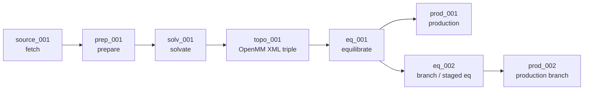

# MDClaw

MDClaw is an agent-facing molecular dynamics workflow toolkit for the
Amber/OpenMM ecosystem. It gives an AI agent short runbooks, a `mdclaw` CLI,
and a durable job DAG so the agent can prepare systems, run equilibration and
production MD, analyze trajectories, and report evidence without hand-editing
state files.

MDClaw is split into two things that are deployed together but should be
understood separately:

| Layer | What It Is | Main Files |
|---|---|---|
| Agent guidance | Skills/runbooks that tell an agent what to do | `skills/`, `.agents/skills/`, `.claude/commands/` |
| MD runtime | The scientific software stack and CLI that perform the work | `bin/mdclaw`, `mdclaw/`, `container/`, `hooks/` |

The skills are text and are portable across agent harnesses. The runtime is
provided by a conda environment, Singularity/Apptainer SIF, Docker image, or a
local editable install.

## Install / Deploy

Choose the path that matches your agent. After installation, run
`scripts/mdclaw-doctor.sh` when using a repo checkout; it checks the runtime,
OpenMM, AmberTools, container availability, and skill discovery.

### Claude Code Plugin

Use this when you want `/mdclaw:*` slash commands and the plugin-managed
container hook.

```text
/plugin marketplace add matsunagalab/mdclaw
/plugin install mdclaw@mdclaw
```

The plugin provides:

- `.claude-plugin/`: marketplace metadata.
- `hooks/hooks.json`: SessionStart hook that runs `scripts/setup-container.sh`.
- `bin/mdclaw`: runtime wrapper that chooses conda, SIF, or Docker.
- `skills/`: the same runbooks used by other agents.

The container is downloaded on first session start. On HPC it prefers a SIF
for Singularity/Apptainer; on desktop it can use Docker.

### Pi

Pi reads skills from the repository package metadata:

```bash
pi install git:github.com/matsunagalab/mdclaw@main
```

`package.json` points Pi at `./skills`. You still need one MD runtime:
the `mdclaw` conda env, a SIF through `MDCLAW_SIF`, Docker through
`MDCLAW_DOCKER_IMAGE`, or the plugin/container wrapper.

### Codex, OpenCode, and Generic Agents

Use this path when an agent discovers skills from `.agents/skills`.

```bash
git clone https://github.com/matsunagalab/mdclaw
cd mdclaw
scripts/install-agent-skills.sh
scripts/mdclaw-doctor.sh
```

`scripts/install-agent-skills.sh` creates `.agents/skills/<name>` symlinks to
`skills/<name>`. Use `scripts/install-agent-skills.sh --copy` if your agent or
filesystem does not follow symlinks.

### Repo-Local Claude Code Development

When working directly in this repository, `.claude/commands/` exposes local
development slash commands:

```text
/md-prepare
/md-equilibration
/md-production
/md-analyze
/hpc-run
```

These are thin wrappers around `skills/*/SKILL.md`. The plugin-installed form
uses `/mdclaw:md-prepare`, `/mdclaw:md-equilibration`, and so on.

### Local Runtime

For development or non-plugin usage, create the conda environment:

```bash
conda env create -f environment.yml
conda activate mdclaw
pip install -e .
mdclaw --list
```

`bin/mdclaw` chooses a runtime in this order:

1. `MDCLAW_RUNTIME=conda|singularity|apptainer|docker`, if set.
2. A conda env named `mdclaw`, if available.
3. Singularity/Apptainer with `MDCLAW_SIF` or an auto-downloaded SIF.
4. Docker image `ghcr.io/matsunagalab/mdclaw:<version-or-latest>`.
5. A local `mdclaw` on `PATH`.

See `docs/agents/deployment.md` for the full deployment matrix and
`docs/developer/container.md` for container details.

## Basic Workflow

The normal user-facing sequence is:

```text
md-prepare -> md-equilibration -> md-production -> md-analyze
```

Example prompts for a skill-aware agent:

```text
/mdclaw:md-prepare 1AKE chain A, no ligands, explicit water, defaults
/mdclaw:md-equilibration job_a1b2c3d4
/mdclaw:md-production job_a1b2c3d4, 10 ns
/mdclaw:md-analyze RMSD and RMSF for job_a1b2c3d4
```

The equivalent repo-local Claude Code commands omit the `mdclaw:` prefix.

You can also call the CLI directly. DAG workflow tools need an explicit
`--job-dir` and `--node-id`; skills usually create and pass those for you.

```bash
mdclaw --list
mdclaw fetch_structure --help
mdclaw inspect_molecules --structure-file structure.pdb
```

## Prompt Examples

These examples are written as prompts to a skill-aware agent. The goal is not
just to run commands, but to leave a clean DAG, explicit assumptions, and
reviewable evidence.

### Minimal Protein Workflow

```text
/mdclaw:md-prepare 1AKE chain A, protein only, explicit water, default force field and water model. Create a new job and report the job_dir.

/mdclaw:md-equilibration <job_dir> with the default staged protocol. Stop after equilibration and summarize the completed nodes.

/mdclaw:md-production <job_dir>, 10 ns, default HMR settings. Use the equilibrated state from the DAG.

/mdclaw:md-analyze <job_dir>. Report RMSD, RMSF, energy stability, and the exact production node used.
```

### Ligand-Bound Complex

```text
/mdclaw:md-prepare PDB 1AKE. Inspect molecules first, keep chain A and ligand AP5 if present, preserve ligand coordinates, use explicit water, and stop if ligand parameterization is blocked.
```

For ligand systems, name the ligand policy explicitly: keep the bound ligand,
remove all ligands, or keep only specific ligand IDs from inspection.

### Nucleic Acids, PTMs, and Variants

```text
/mdclaw:md-prepare <structure> with protein chains A/B and DNA or RNA chains C/D. Use the standard nucleic-acid path when possible and report any unsupported modified residues before topology build.
```

```text
/mdclaw:md-prepare <job_dir> branch from prep_001, apply mutation V148A, then solvate and build a separate topology branch. Keep the original branch intact.
```

```text
/mdclaw:md-prepare <job_dir> branch from prep_001, restore detected phosphorylation sites if valid, and stop with structured diagnostics if any target residue cannot be located.
```

### HPC and Long Runs

```text
/mdclaw:hpc-run inspect the cluster, then submit production for <job_dir> from prod-ready node eq_001: 100 ns, GPU partition, one job per production branch. Record the SLURM job IDs in the DAG.
```

```text
/mdclaw:hpc-run check SLURM job <job_id>, sync the node status, and report whether the DAG has a completed production state, checkpoint, trajectory, and energy log.
```

### Restart, Extension, and Evidence

```text
/mdclaw:md-production <job_dir>, extend the latest completed production node by 50 ns. Use the nearest production state from the DAG and create a new child production node.
```

```text
/mdclaw:md-analyze <job_dir>, then generate an evidence summary and a methods-style report from the selected source -> prep -> solv -> topo -> eq -> prod lineage.
```

### Benchmark Prompts

```text
Run MDAgentBench task T01_engine_smoke as an evaluated agent. Read only the task prompt as the agent instruction, write the required submission artifacts, then run the validator and scorer commands.
```

```text
Run the full MDAgentBench suite and report which tasks had real MD execution, which tasks were blocked, which tasks were partial, and why. Do not describe the result as a full MD benchmark unless the long MD tasks were actually attempted.
```

### Prompt Quality Checklist

Good MDClaw prompts usually specify:

- Structure source: PDB ID, AlphaFold/UniProt ID, local file, or existing
  `job_dir`.
- Molecular selection: chains, ligands, waters, ions, glycans, DNA/RNA, PTMs.
- Simulation model: explicit or implicit solvent, water model, salt, force
  field, membrane if needed.
- Runtime target: local smoke test, real local run, HPC submission, or scoring
  only.
- Duration and ensemble: equilibration protocol, production length, NVT/NPT,
  seeds when comparing branches.
- Stopping policy: continue autonomously, ask at ambiguous decisions, or stop
  on structured blocked states.
- Reporting target: node IDs, artifacts, validation output, evidence report,
  methods report, or benchmark score.

Weak prompts hide important choices:

```text
Run MD for this protein.
```

Better prompts make the scientific and operational contract explicit:

```text
/mdclaw:md-prepare PDB 1AKE chain A, remove all ligands, explicit OPC water with 15 A buffer and 0.15 M salt. Use defaults otherwise, create a clean DAG, and stop if topology build is unsupported.
```

## Job DAG In One Picture

Every job is a DAG of workflow nodes. Tools mutate node state; skills only
decide what to run next.



Key rules:

- One `job_dir` is one physical system with one `source` root.
- Variants branch after `prep`, `solv`, `topo`, `eq`, or `prod`.
- `topo` writes the modern OpenMM triple: `system.system.xml`,
  `system.topology.pdb`, and `system.state.xml`.
- `eq` and `prod` auto-resolve their inputs from ancestor nodes.
- `progress.json` is only an index; each node owns its own `node.json`,
  lock, and `artifacts/`.

Detailed DAG structure, study directories, and node invariants live in
`docs/developer/architecture.md`.

## Repository Map

| Path | Role |
|---|---|
| `skills/` | Portable agent runbooks. This is the source of truth for skill behavior. |
| `.agents/skills/` | Generic Agent Skills discovery entries, symlinked to `skills/`. |
| `.claude/commands/` | Repo-local Claude Code slash-command wrappers for development. |
| `.claude-plugin/` | Claude plugin marketplace metadata. |
| `hooks/` | Plugin lifecycle hooks, including container setup. |
| `bin/mdclaw` | Runtime wrapper used by plugin and local deployments. |
| `mdclaw/` | Python package and CLI tool implementations. |
| `container/` | Docker/Singularity build assets. |
| `benchmarks/mdagentbench/` | MDAgentBench dataset and scorer contracts. |
| `docs/agents/` | Deployment notes for agent harnesses. |
| `docs/developer/` | Architecture, CLI internals, testing, release, and tool references. |
| `tests/` | Unit, smoke, benchmark, and integration tests. |

## What MDClaw Supports

- Protein systems with Amber ff19SB / OpenMM.
- Explicit solvent setup, defaulting to OPC, 15 A buffer, and 0.15 M salt.
- HMR production runs with 4 fs timestep by default.
- Standard DNA/RNA through OL15/OL3 XMLs.
- Ligand preparation through curated Amber/OpenMM pathways where supported.
- Branching workflows for mutations, PTMs, modified nucleic acids, membrane
  embedding, alternate equilibration protocols, and production variants.
- SLURM submission and restart/extension workflows through `hpc-run`.

Some chemistry remains deliberately guarded. If a force-field conversion or
parameterization path is not safe, tools return structured error codes instead
of silently building a dubious system.

## Benchmarking

MDClaw includes MDAgentBench under `benchmarks/mdagentbench/`. The benchmark is
agent-agnostic: evaluated agents read `prompt.md` and write `submission/`;
the scorer reads `task.json`, scorer-only truth files, and submitted artifacts.

Useful scorer commands:

```bash
mdclaw init_benchmark_run --output-dir benchmark_runs --run-id <run_id>
mdclaw validate_benchmark_submission --task-file benchmarks/mdagentbench/tasks/T01_engine_smoke/task.json --submission-dir <submission_dir>
mdclaw score_benchmark_submission --task-file benchmarks/mdagentbench/tasks/T01_engine_smoke/task.json --submission-dir <submission_dir> --run-id <run_id> --output-file benchmark_runs/<run_id>/tasks/T01_engine_smoke/score.json
mdclaw summarize_benchmark_run --run-dir benchmark_runs/<run_id>
```

See `docs/benchmark/README.md` for the benchmark contract.

## Developer Quickstart

```bash
conda env create -f environment.yml
conda activate mdclaw
pip install -e .
ruff check mdclaw/
pytest tests/test_mcp_server.py tests/test_cli.py tests/test_guardrails.py tests/test_slurm_server.py -v
```

Short agent guidance is mirrored in `CLAUDE.md` and `AGENTS.md`; keep those
files identical. Long-form references:

- `docs/developer/architecture.md`
- `docs/developer/tool-reference.md`
- `docs/developer/cli-internals.md`
- `docs/developer/testing.md`
- `docs/developer/configuration.md`
- `docs/developer/container.md`
- `docs/developer/release.md`

## Release

Follow `docs/developer/release.md`. Version tags must stay synchronized across
the Python package, plugin metadata, marketplace metadata, and container image.

Users update the plugin with:

```text
/plugin update mdclaw@mdclaw
```

## License

MIT

## Citations

- Boltz-2: S. Passaro et al., bioRxiv (2025). doi:10.1101/2025.06.14.659707
- AmberTools: D. A. Case et al., J. Chem. Inf. Model. 63, 6183 (2023).
- OpenMM: P. Eastman et al., J. Phys. Chem. B 128, 109 (2024).
