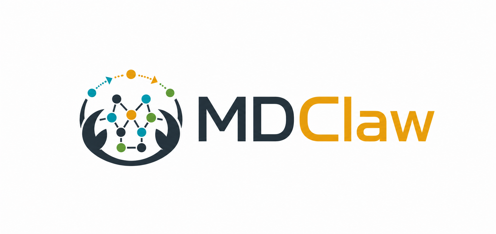

<p align="center">
  
</p>

# MDClaw

MDClaw provides agent skills and CLI tools for molecular dynamics (MD) and
autonomous scientific investigation in the Amber/OpenMM ecosystem. It helps an
AI agent turn scientific intent into reproducible atomistic work: plan a study,
prepare systems, run MD, analyze trajectories, branch hypotheses, and package
evidence with provenance.

MDClaw is not one hidden end-to-end planner. Its responsibilities are explicit:

- **Skills** translate scientific intent into an MD procedure.
- **CLI tools** execute concrete operations and record their outputs.
- **A durable DAG** is the source of truth for progress, artifacts, failures,
  branching, and re-entry by another agent.

## How It Works

Every run is a small study, even when it contains only one system. A study can
hold one or more job DAGs, and each job follows the same artifact handoff:

```text
source -> prep -> solv -> topo -> min -> eq -> prod -> analyze
```

The CLI manages node state and passes artifacts between stages. A later agent
can use `inspect_job` to resume from completed work, `explain_node` to validate
the next node before execution, and `trace_failure` to choose a new recovery
branch without rewriting terminal history.

The request controls how far the agent proceeds. MDClaw can stop after planning
or any named stage, or continue through analysis when the user explicitly asks
for an evidence-backed scientific answer. It does not treat a plan as permission
to run every stage or submit HPC jobs.

## Install / Deploy

MDClaw needs two things:

1. **Agent skills** from `skills/`, unless you use the CLI directly.
2. **One scientific runtime** containing the `mdclaw` CLI, AmberTools, OpenMM,
   and the Python dependencies.

### Fastest Setup From A Checkout

Install Singularity/Apptainer or Docker first. For Conda instead, create the
environment under [Choose One Runtime](#choose-one-runtime) before running this
block; the setup script will detect and reuse it.

```bash
git clone https://github.com/matsunagalab/mdclaw.git
cd mdclaw

# Expose the skills to repo-local agent harnesses.
scripts/install-agent-skills.sh

# Reuse a conda env named mdclaw, or pull the matching SIF/Docker image.
scripts/setup-container.sh

# Make the runtime-selecting wrapper available in this shell.
export PATH="$PWD/bin:$PATH"

mdclaw --version
mdclaw --list-json bootstrap_md_workflow
scripts/mdclaw-doctor.sh
```

`scripts/setup-container.sh` does not rebuild anything. It reuses an existing
`mdclaw` conda environment; otherwise it downloads the version-matched runtime
from `ghcr.io/matsunagalab/mdclaw` using Singularity/Apptainer or Docker.

### Install Skills For Your Agent

| Agent or use case | Skill setup | Runtime setup |
|---|---|---|
| Claude Code plugin | `/plugin marketplace add matsunagalab/mdclaw`, then `/plugin install mdclaw@mdclaw` | Session-start hook runs the packaged-runtime setup |
| Pi | `pi install git:github.com/matsunagalab/mdclaw@main` | Provide one runtime below; Pi installs skills only |
| Codex, OpenCode, generic repo-local agents | `scripts/install-agent-skills.sh` | Provide one runtime below |
| Direct CLI or development | Skills are optional | Use Conda or a packaged runtime below |

The installer creates discovery mirrors under `.agents/skills`,
`.claude/skills`, and `.codex/skills` of the directory you run it from, so
running it inside another project installs the skills there; `skills/` in this
checkout remains the only source of truth. Pass a directory
(`scripts/install-agent-skills.sh ~/work/other-project`) to install elsewhere,
`--user` to install user-level mirrors under `$HOME` for every project, and
`--copy` on filesystems that do not support symlinks.

### Choose One Runtime

**Conda: local development or a controlled workstation**

```bash
conda env create -f environment.yml
export MDCLAW_RUNTIME=conda
export PATH="$PWD/bin:$PATH"
mdclaw --list-json bootstrap_md_workflow
```

`environment.yml` installs this checkout in editable mode. The wrapper invokes
it with `conda run`, so activation is optional.

**Singularity/Apptainer SIF: recommended for Linux HPC**

```bash
singularity pull mdclaw.sif \
  docker://ghcr.io/matsunagalab/mdclaw:latest
export MDCLAW_SIF="$PWD/mdclaw.sif"
export MDCLAW_RUNTIME=singularity
export PATH="$PWD/bin:$PATH"
mdclaw --list-json bootstrap_md_workflow
```

Use `apptainer pull` and `MDCLAW_RUNTIME=apptainer` instead when that is the
installed command.

**Docker: desktop or workstation container runtime**

```bash
docker pull ghcr.io/matsunagalab/mdclaw:latest
export MDCLAW_RUNTIME=docker
export MDCLAW_DOCKER_IMAGE=ghcr.io/matsunagalab/mdclaw:latest
export PATH="$PWD/bin:$PATH"
mdclaw --list-json bootstrap_md_workflow
```

`bin/mdclaw` selects exactly one runtime for each call. The order is an explicit
`MDCLAW_RUNTIME=conda|singularity|apptainer|docker` override, then conda env
`mdclaw`, SIF, Docker, and finally a local `mdclaw` executable. Set the override
when more than one is installed and you need predictable selection. Container
calls bind the current working directory at the same absolute path, so run from
the study/project directory and keep inputs below it.

Troubleshooting and less common deployment layouts are in
`docs/agents/deployment.md`; image and SIF details are in
`docs/developer/container.md`.

### AI Model Backends (BioEmu, Boltz-2)

BioEmu (monomer conformational ensembles) and Boltz-2 (structure prediction,
pinned to 2.2.1) are optional. They are **not** in the core conda environment or
container because their Torch/CUDA stacks are independent. Install only the
backend you need:

```bash
mdclaw setup_model_backend --model bioemu --device cuda
mdclaw setup_model_backend --model boltz  --device cuda
mdclaw check_model_backend  --model bioemu
mdclaw check_model_backend  --model boltz
```

On a read-only SIF, point `MDCLAW_SURROGATE_DIR` at a writable (ideally shared)
filesystem and bind-mount it so the venv and model weight caches persist.

BioEmu can then generate a monomer conformational ensemble as a source bundle:

```bash
mdclaw generate_surrogate_candidates \
  --model bioemu \
  --amino-acid-sequence YYDPETGTWY \
  --num-samples 100 \
  --max-candidates 20 \
  --job-dir <job_dir> \
  --node-id source_001
```

The generated candidates are recorded in the source node's `source_bundle.json`
with `source_type="surrogate"` and can be consumed by
`prepare_complex --source-candidate-id candidate_NNN`. Boltz-2 is driven through
the `boltz-predict` skill / `boltz2_protein_from_seq` tool once its backend is
installed. See `docs/developer/model-backends.md` for the registry contract and
how to add or swap a model.

## Ask In Plain Language

Users do not need to remember command names. The framing of your request
decides where MDClaw stops. There are three patterns:

**Plan only.** Ask the agent to plan a study. It records a lightweight
`study_plan.json` (question, MD goal, planned jobs, observables, decision
criteria) and stops so you can review before any system is built.

```text
Plan an MD study for the PSD-95 PDZ3 domain bound to the CRIPT peptide
(PDB 1BE9). Test whether the H372A mutation weakens dynamic coupling between
the distal alpha-3 helix and the peptide-binding groove. Define the WT and
mutant jobs, peptide-contact and groove-dynamics observables, and decision
criteria.
```

**Run to a stage or resume.** Name the last stage you need: preparation,
equilibration, production, or analysis. For an existing study or job, state
the new purpose; MDClaw inspects the DAG, reuses completed artifacts, and
continues only as far as that request requires. A direct one-system run still
gets a thin study record with one `jobs/main` job.

```text
Prepare PDB 1AKE chain A as a protein-only explicit-water system using the
default force field and water model. Continue through default equilibration
and stop before production.
```

**Scientific answer.** Explicitly ask the agent to answer the scientific
question using MD. It advances every required job through the planned
analysis, packages evidence, applies the decision criteria, and returns a
supported conclusion.

```text
Set up and run an apo-vs-holo MD study for the T4 lysozyme L99A
benzene-binding cavity (benzene-bound PDB 4W53). Test whether benzene
occupancy stabilizes the engineered hydrophobic cavity. Plan the minimal
job set, prepare and equilibrate it, run 50 ns of production per job,
analyze cavity hydration and ligand-pose observables, and return an
evidence-backed conclusion.
```

Good prompts for **planning** state the scientific question, comparison
groups, and what evidence would answer the question. Good prompts for a
**stage or resume** name the target study or structure and the last required
stage. Good prompts for a **scientific answer** add a production length,
replicate count, observables, and the conclusion to be supported. If required
work remains queued or running, MDClaw reports a resumable DAG handoff instead
of claiming completion. HPC/SLURM submission occurs only when the current
request explicitly asks for it.

## Repository Map

| Path | Role |
|---|---|
| `skills/` | Portable MDClaw skills. This is the source of truth for skill behavior. |
| `.agents/skills/` | Generic Agent Skills discovery entries, symlinked to `skills/`. |
| `.claude/skills/` | Repo-local Claude Code skill discovery entries, symlinked to `skills/`. |
| `.claude-plugin/` | Claude plugin marketplace metadata. |
| `hooks/` | Plugin lifecycle hooks, including packaged runtime setup. |
| `bin/mdclaw` | Runtime wrapper used by plugin and local deployments. |
| `mdclaw/` | Python package and CLI tool implementations. |
| `container/` | Docker image and Singularity/Apptainer SIF build assets for the packaged MD runtime. |
| `benchmarks/mdprepbench/` | Preparation workflow benchmark tasks and scorer contracts. |
| `benchmarks/mdstudybench/` | Scientific question and study-bundle benchmark tasks. |
| `docs/agents/` | Deployment notes for agent harnesses. |
| `docs/developer/` | Architecture, CLI internals, testing, release, and tool references. |
| `tests/` | Unit, smoke, benchmark, and integration tests. |

## Supported Capabilities

| Area | Current support |
|---|---|
| Study and workflow | Minimal one-system plans and multi-job comparative studies; resumable per-job DAGs; immutable completed/failed nodes; explicit branches for variants and recovery. |
| Structure sources | PDB, AlphaFold/UniProt, and local PDB/mmCIF; biological assemblies and multi-model source bundles; optional source generation with Boltz-2, BioEmu, and MODELLER. |
| Inspection and selection | Proteins, DNA/RNA, ligands, waters, bare ions, glycans, PTMs, chain identity, source candidates, and covalent protein-glycan connectivity before preparation. |
| Protein and nucleic force fields | Amber ff19SB by default (ff14SB available), standard DNA OL15, and standard RNA OL3. Nucleic terminal charge corrections are derived from the selected force-field XML. |
| Ligands, glycans, and PTMs | Noncovalent small molecules through GAFF2 with OpenFF NAGL charges and AM1-BCC fallback; covalently linked glycans through GLYCAM; SEP/TPO/PTR phosphorylation parameters. |
| Solvent and membranes | Explicit water (ff19SB + OPC, 15 A buffer, and 0.15 M salt by default), implicit solvent, vacuum, and Lipid21 membranes. The patch-tile membrane path supports selected neutral and anionic mixtures, including POPC/POPG, and derives lipid templates and charges from the active XML files. |
| Simulation | Standalone minimization, staged NVT/NPT equilibration, production MD, HMR (4 fs production default), XML-state restart, extensions, replicates, and optional PythonTorchForce custom bias/CV scripts. |
| Analysis and evidence | Trajectory concatenation/fitting, RMSD, RMSF, distances, contact frequencies, Q values, equilibration detection, custom-result registration, provenance reports, Methods-style reports, and study-level evidence packages. |
| Execution | Local Conda, Docker, Singularity/Apptainer SIF, explicit SLURM submission/monitoring, and homogeneous job arrays. |
| Evaluation | Agent-agnostic MDPrepBench and MDStudyBench runners, public task packaging, raw-artifact validation, and scoring. |

Support is fail-closed where MDClaw can check the contract. Ambiguous molecule
selection, missing force-field templates, inconsistent charges, invalid DAG
parents, or incomplete topology artifacts return stable error codes and preserve
the failed node for provenance instead of silently continuing.

## Boundaries And Non-Goals

- **No unrequested end-to-end execution.** A plan records intent; it is not
  permission to run production, analysis, or HPC submission. The current
  request sets the stopping point. Long studies can be handed to another agent
  and resumed from the DAG.
- **Modified DNA/RNA is not supported by the standard MD-ready topology path.**
  Inspection stops before an unsafe ordinary-nucleotide substitution. The
  legacy modXNA helper is experimental and does not make that path supported;
  a user-supplied OpenMM System/ForceField escape hatch remains possible.
- **PTM coverage is deliberately narrow.** Phospho-histidine, O-GlcNAc,
  acetylation, methylation, ubiquitination, lipidation, and selectable phosphate
  protonation states are not turnkey workflows.
- **Specialized chemistry still needs an explicit model.** MDClaw does not
  automatically create covalent-ligand parameters, bonded metal-center models,
  or general organometallic chemistry. Supported bare structural ions are
  checked against the selected water/ion force-field templates.
- **Force-field scope is Amber/OpenMM, not universal.** Arbitrary force fields,
  CHARMM-native preparation, coarse-grained or polarizable models, and QM/MM are
  outside the standard workflow.
- **Advanced sampling and free-energy methods are not turnkey pipelines.** The
  custom-force interface can run a user-defined bias, but MDClaw does not yet
  provide complete alchemical FEP/TI, replica-exchange, metadynamics, or
  umbrella-sampling/PMF campaign automation and validation.
- **One job has one structural source identity.** Its source bundle may contain
  many candidates, but `prep` selects one. Put independent starting systems in
  separate study jobs; branch a prepared job for mutations, ligands, protocols,
  temperatures, or seeds.
- **Guardrails are not scientific proof.** Passing topology, charge, energy,
  and artifact checks does not establish convergence, adequate sampling, or a
  biological conclusion. Those require appropriate controls, replicates,
  analysis, and expert review.

## Benchmarking

The MDAgentBench suites live in their own public repositories:

- [matsunagalab/MDPrepBench](https://github.com/matsunagalab/MDPrepBench) —
  40-task MD system preparation battery, deterministic artifact scoring.
- [matsunagalab/MDStudyBench](https://github.com/matsunagalab/MDStudyBench) —
  scientific question answering with runner-certified confirmatory MD and the
  grounded-correct contract.

The MDStudyBench confirmatory runner executes MDClaw production nodes, so it
depends on this package at runtime. MDClaw's CLI cooperates with both harnesses
by appending measured execution records to `$MDCLAW_BENCHMARK_HARNESS_LOG`
(see `mdclaw/_cli.py`); that stage-record protocol is part of MDClaw's public
contract with the benchmark repositories.

## Developer Quickstart

```bash
conda env create -f environment.yml   # installs the mdclaw CLI editable (-e .)
conda activate mdclaw
ruff check mdclaw/
pytest tests/test_mcp_server.py tests/test_cli.py tests/test_guardrails.py tests/test_slurm_server.py -v
```

Short agent guidance is mirrored in `CLAUDE.md` and `AGENTS.md`; keep those
files identical. Long-form references:

- `docs/developer/architecture.md`
- `docs/developer/tool-reference.md`
- `docs/developer/cli-internals.md`
- `docs/developer/testing.md`
- `docs/developer/configuration.md`
- `docs/developer/container.md`
- `docs/developer/release.md`

## Release

Follow `docs/developer/release.md`. Version tags must stay synchronized across
the Python package, plugin metadata, marketplace metadata, and container image.

Users update the plugin with:

```text
/plugin update mdclaw@mdclaw
```

## License

MIT
