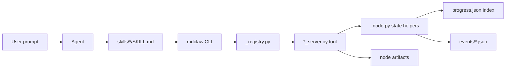
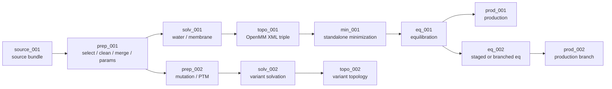
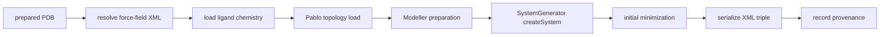
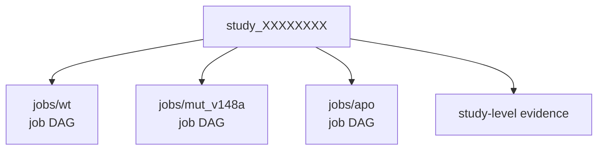

# MDClaw Developer Architecture

MDClaw provides skills and CLIs for vibe-MD simulations and autonomous
scientific investigation. The skills turn scientific intent into MD actions,
the Python tool modules do the work, and the node DAG records what actually
happened.

## Mental Model

| Layer | Responsibility | Main Files |
|---|---|---|
| Skill layer | Agent-facing MD decision policy and procedures | `skills/`, `.agents/skills/`, `.claude/skills/` |
| CLI and dispatch | Parse command-line calls, discover tools, inject node context | `bin/mdclaw`, `mdclaw/_cli.py`, `mdclaw/_registry.py` |
| Tool execution | Fetch structures, prepare systems, build OpenMM XML, run MD, analyze output | `mdclaw/*_server.py` |
| State and evidence | Record node status, artifacts, events, and reports | `mdclaw/_node.py`, `mdclaw/_event.py`, `mdclaw/evidence_server.py` |
| Distribution | Package skills and runtime for users | `.claude-plugin/`, `hooks/`, `container/`, `scripts/` |

The key design split is:

- **Skills translate scientific intent into tool choices.**
- **Tools run it and record state.**
- **The DAG is the source of truth for workflow progress.**
- **Study planning records the scientific question, MD goal, planned jobs,
  analysis intent, and decision criteria without replacing per-job DAG state.**

Deployment details live in `docs/agents/deployment.md`.

## Request Path

A normal skill-driven request follows this path:



Important boundaries:

- `skills/*/SKILL.md` should contain scientific decision policy and tool-use
  procedure, not hidden state mutation logic.
- `_cli.py` is the common entry point for direct users and agents.
- `_registry.py` maps public tool names to `mdclaw/*_server.py` functions.
- Workflow tools receive `job_dir` and `node_id`, then call `begin_node`,
  `complete_node`, or `fail_node`.
- `progress.json` is a thin index. Each node owns its durable details in
  `nodes/<node_id>/node.json` and `nodes/<node_id>/artifacts/`.

## Repository Map

| Path | Role |
|---|---|
| `skills/` | Source-of-truth MDClaw skills. |
| `.agents/skills/` | Generic Agent Skills discovery surface, normally symlinked to `skills/`. |
| `.claude/skills/` | Repo-local Claude Code skill discovery surface, normally symlinked to `skills/`. |
| `.claude-plugin/` | Claude plugin marketplace metadata. |
| `hooks/` | Plugin lifecycle hooks, including packaged runtime setup. |
| `bin/mdclaw` | Runtime wrapper that selects conda, SIF, Docker, or local CLI. |
| `mdclaw/` | Python package, CLI dispatch, server tools, state helpers. |
| `container/` | Docker image and Singularity/Apptainer SIF build assets for the packaged MD runtime. |
| `scripts/` | Setup, doctor, release, and maintenance scripts. |
| `benchmarks/mdprepbench/` | Preparation benchmark prompts, scorer-only metadata, and truth artifacts. |
| `benchmarks/mdstudybench/` | Scientific-study benchmark prompts, scorer-only metadata, and truth artifacts. |
| `docs/` | User, agent, developer, benchmark, and research documentation. |
| `tests/` | Unit, smoke, benchmark scorer, and integration tests. |

## Core Python Modules

| Module | Responsibility |
|---|---|
| `_common.py` | Logging, directories, command wrappers, guardrails, shared helpers. |
| `_registry.py` | Server registry used by CLI discovery. |
| `_cli.py` | CLI entry point, JSON input handling, global `--job-dir` / `--node-id` injection. |
| `_node.py` | Schema v3 node DAG management, artifact registration, status transitions. |
| `_event.py` | Append-only JSON event log. |
| `_lock.py` | File-based locking with `fcntl.flock`. |
| `*_server.py` | Public tool modules. Each exposes a `TOOLS` dict. |

## Job DAG

The study layer is the normal outer record for every MD workflow. A simple
one-system request is still represented as a study with one job, usually
`jobs/main`, and it still has a minimal `study_plan.json`. Broader
investigations register multiple job DAGs under the same study.

Node type names are short on disk and in the CLI, while design discussions use
the formal names from `CONTEXT.md`:

| CLI / Disk Type | Formal Name | Usual Product |
|---|---|---|
| `source` | Source Node | Source Bundle |
| `prep` | Preparation Node | Prepared System |
| `solv` | Solvation Node | Solvated System |
| `topo` | Topology Node | Topology |
| `min` | Minimization Node | Minimized state artifacts |
| `eq` | Equilibration Node | Equilibrated state artifacts |
| `prod` | Production Node | Production Segment artifacts |
| `analyze` | Analysis Node | Analysis evidence artifacts |

Inside a job, the `source` node acquires structural input, records a structural
source bundle, and normalizes downstream-selectable candidates. The required
execution contract is `source_bundle.json` plus normalized
`artifacts/candidates/candidate_*.pdb|cif` files. Raw input files may also be
kept for provenance, but `prep` always selects one candidate file before
producing an MD-ready physical system. Candidate files can come from ordinary
single structures, NMR models split out of a multi-model PDB/mmCIF, PDB
assembly/chain choices, or generated prediction ensemble members from
Boltz/BioEm-like tools. Generator-specific rank and confidence data live on
the relevant candidate records and are surfaced through `list_source_candidates`.
Variants then branch from `prep`, `solv`, `topo`, `min`, `eq`, or `prod`.

Preparation nodes select one candidate, choose MD-relevant molecular
components, clean and standardize them, record chemistry and provenance for
topology building, and produce a prepared system. They do not create explicit
solvent boxes, apply force fields, or run MD protocols.

Topology nodes own force-field, template, and parameter resolution. Preparation
nodes provide chemistry and provenance materials such as ligand chemistry,
disulfide records, component disposition, and chain identity; topology nodes
turn those materials into an MD-ready topology artifact contract.

Minimization nodes own post-topology coordinate relaxation before MD
equilibration. They consume the topology node's OpenMM XML triple and write a
portable minimized `state` plus `minimized_structure.pdb` and
`minimization_report.json`. Equilibration nodes should parent from `min` by
default; direct `topo -> eq` remains only a compatibility fallback.

Production continuations are represented as new Production Nodes in the same
Production Chain. The timeline metadata continues from the selected ancestor,
but each Production Segment writes its own node-owned artifacts.

Analysis nodes declare an Analysis Data Scope. The condition field is
`analysis_data_scope`, with supported values `segment`, `production_chain`, and
`comparison`. A single production parent can mean either the parent Production
Segment or the full Production Chain ending at that leaf, depending on the
analysis intent. A comparison node consumes exactly two analyze parent nodes;
create one `production_chain` analyze node per branch first, then compare those
analysis artifacts. The comparison node owns `analysis_subjects` and
`comparison_mapping` in its own conditions; parent analyze nodes describe their
own data scope, not the cross-branch subject namespace or correspondence. The
resolver continues to expose multi-parent analyze inputs as `branches_input`;
that internal name is kept for existing tools even when the data scope is
`comparison`.
Cross-topology comparisons are allowed only when the Analysis Subjects and
Comparison Mapping are explicit; the same-topology path may use one shared
topology file, but different-topology comparisons need per-branch topology and
mapping data rather than atom-index assumptions. Initial support should not
infer mappings automatically from sequence or residue similarity. Initial
mapping types are limited to `residue_number` and `atom_selection`.
Analysis tools should apply lightweight validation before execution: required
condition fields, supported scope and mapping type values, subject labels, and
mapping references should be syntactically consistent. Topology-backed checks
such as referenced residue/atom existence and per-branch compatibility are
metric-specific checks, not a global gate.
For `analysis_data_scope="comparison"`, `analysis_subjects` and
`comparison_mapping` are required. For `segment` and `production_chain`,
`analysis_subjects` is optional unless a metric-specific tool requires a
subject. Subject entries only require a unique `label` at this layer; descriptor
fields such as `chain_id`, `selection`, `residue_range`, or `resname` remain
metric-specific. Initial comparison support is binary/pairwise: exactly two
analyze parents and exactly two subjects per comparison node. Residue-number
mapping keeps the lightweight string form `subject_label:residue_id` in `pairs`,
with each pair referencing both subjects exactly once. The `residue_id` part is
an opaque string, not a number, so insertion codes and source-specific residue
identifiers remain representable. Atom-selection mapping uses a `selections`
object keyed by the two subject labels. Selection values are mdtraj selection
strings; lightweight validation only checks that they are present and non-empty.

Recommended comparison conditions:

```json
{
  "analysis_data_scope": "comparison",
  "analysis_subjects": [
    {"label": "apo"},
    {"label": "holo"}
  ],
  "comparison_mapping": {
    "type": "residue_number",
    "pairs": [
      ["apo:10", "holo:10"],
      ["apo:11", "holo:11"]
    ]
  }
}
```



Node artifacts are intentionally local to each node:

| Node Type | Typical Artifacts |
|---|---|
| `source` | `source_bundle.json`, normalized `candidates/candidate_*` files, optional raw downloaded/copied/generated structures, source metadata, optional `inspection.json`. |
| `prep` | `source_selection.json`, cleaned/merged PDB, `chain_identity_map.json`, `ligand_chemistry.json`, `residue_mapping.json`, branch-specific prepared structures. |
| `solv` | `solvated.pdb`, `box_dimensions.json`, membrane metadata when applicable. |
| `topo` | `system.system.xml`, `system.topology.pdb`, `system.state.xml`, force-field provenance. |
| `min` | `minimized_structure.pdb`, `minimized.xml`, `minimization_report.json`. |
| `eq` | `equilibrated.pdb`, `equilibrated.xml`, `equilibrated.chk`, stage logs. |
| `prod` | `trajectory.dcd`, `final_structure.pdb`, `state.xml`, `checkpoint.chk`, `energy.dat`. |

The canonical study layout is:

```text
study_XXXXXXXX/
  study.json
  study_plan.json
  plans/
    extension_or_revision.json
  jobs/
    main/
      progress.json
      nodes/
      events/
  annotations/
  evidence/
```

Use `mdclaw bootstrap_md_workflow` for the common one-job case. It creates or
reuses `study.json`, records the active plan, registers `jobs/main`, and writes
the job-level `progress.json` params that connect the job DAG back to the study
and plan.

Inside each job, the DAG shape is:

```text
jobs/main/
  progress.json
  progress.lock
  nodes/
    source_001/
      node.json
      node.lock
      artifacts/
        source_bundle.json
        1AKE.cif
        candidates/
          candidate_001.cif
          candidate_002.cif
    prep_001/
      node.json
      node.lock
      artifacts/
        source_selection.json
    solv_001/
      node.json
      node.lock
      artifacts/
    topo_001/
      node.json
      node.lock
      artifacts/
    min_001/
      node.json
      node.lock
      artifacts/
    eq_001/
      node.json
      node.lock
      artifacts/
    prod_001/
      node.json
      node.lock
      artifacts/
  events/
    <ISO8601>_<node_id>_<event_type>.json
```

DAG invariants:

- Parent-child relationships are stored in each node's `parent_node_ids`.
- Workflow nodes require both `job_dir` and `node_id`.
- Tools should auto-resolve inputs from ancestors when that is the documented
  contract.
- A completed topology node must provide the full OpenMM XML triple; run-side
  tools do not fall back to legacy Amber `parm7/rst7`.
- New equilibration DAGs should use `topo -> min -> eq`; `eq` can still accept
  `topo` directly for legacy records, but skills should not create that shape.
- Completed node.json records are sealed scientific records. Create a new node
  for changed conditions, parents, artifacts, or scientific metadata.
  Post-completion scheduler observations belong in append-only events.
- Agent claims and open needs are work-routing hints for unfinished or retryable
  nodes. Completion clears those operational hints before sealing the node.
- Events are append-only files, not a shared JSON array.
- Broken or unsupported chemistry should surface as structured errors rather
  than silent best-effort topology builds.

## Orchestration For Weak Agents

The DAG is designed so an agent can resume from durable evidence instead of a
separate next-step planner. Four additive helpers carry that load:

- `inspect_job(job_dir)` reads `progress.json` and returns node statuses,
  leaves, claims, open needs, warnings, and workflow params such as
  `solvent_regime`.
- `explain_node(job_dir, node_id)` validates a candidate node before execution
  and reports `ready_to_run`, resolved inputs, missing inputs, parent status, and
  blocking codes.
- `create_node` auto-resolves the canonical forward parent when
  `parent_node_ids` is omitted (single completed leaf of the preferred parent
  type), so example ids never need to be copied. Ambiguous or empty frontiers
  stay parent-less, preserving branch/sketch/repair flows.
- `trace_failure(job_dir, node_id)` / `explain_failure(job_dir, node_id)` reads
  a failed node, failure artifacts, events, parent/dependency status, and
  existing workflow recommendations. It returns read-only `recovery_options`
  and `next_commands`; it never creates branches automatically.

These are orchestration aids only; the study plan records scientific intent,
and `node.json` + `progress.json` remain the execution source of truth.

Failed nodes keep the core record small: `node.json.metadata.errors`, optional
`metadata.failure_code`, and `artifacts.failure` pointing to
`artifacts/failure/latest/failure_manifest.json`. Full diagnostic evidence
(`tool_result.json`, stderr/stdout tails when available, SLURM log tails from
`check_job`, and tracebacks for unhandled exceptions) belongs under that
failure artifact directory, not in `progress.json`.

## State Files

| File | Purpose |
|---|---|
| `progress.json` | Thin job index: node list, cached summaries, current high-level state. |
| `nodes/<node_id>/node.json` | Authoritative node record: status, parents, artifacts, conditions, metadata. |
| `nodes/<node_id>/node.lock` | Per-node lock for concurrent-safe updates. |
| `nodes/<node_id>/artifacts/` | Tool-owned outputs registered by that node. |
| `events/*.json` | Append-only operational history. |

When debugging, start with the relevant node's `node.json`, then inspect its
registered artifacts and nearby event files. Do not infer workflow state from
loose files in the repository root.

## Topology Build Path

The recommended topology path is `build_amber_system`. It emits the modern
OpenMM triple consumed by equilibration and production:

```text
system.system.xml
system.topology.pdb
system.state.xml
```

The high-level topology pipeline is:



Stages recorded under `topo_NNN/metadata.topology_build_stage_history` include:

```text
resolve_forcefield_xml -> topology_input_ready ->
load_ligand_molecules -> pablo_load -> system_generator_init ->
modeller_prepare -> system_generator_create_system -> initial_minimization ->
serialization -> collect_provenance -> completed
```

The `initial_minimization` stage is topology-time minimization: it validates
the force-field-applied system and writes the initial `state.xml`. It is not an
Equilibration Node and should not be described as an MD equilibration protocol.
The schema-v3 `min` node is separate: it is a node-owned post-topology
minimization step that creates the minimized restart state consumed by `eq`.

Standard ligand records are loaded from `ligand_chemistry` into OpenFF
Molecules. Ligand formal charge is taken from the charged molecule graph.
Topology assigns ligand partial charges with OpenFF NAGL first, then passes the
precharged molecules into `SystemGenerator` / `GAFFTemplateGenerator`; AM1-BCC
is the fallback when NAGL is unavailable or fails. The prep-to-topology ligand
handoff is the `ligand_chemistry` artifact.

`build_openmm_system` is the research escape hatch for explicit custom OpenMM
XML. It emits the same XML triple, so downstream `eq` and `prod` nodes consume
both builders through the same contract.

## Study Directories

Use a `study_dir` for every new scientific question. For a single ordinary MD
run, register one job such as `jobs/main`. When the question spans multiple
systems, such as WT versus mutant or apo versus holo, register multiple
independent `job_dir`s under the same study.



```text
study_XXXXXXXX/
  study.json
  study_plan.json
  decisions.jsonl
  question_history.jsonl
  token_ledger.jsonl
  annotations/
  evidence/
  jobs/
    wt/
      progress.json
      nodes/source_001/...
    mut_v148a/
      progress.json
      nodes/source_001/...
```

`study_server.py` manages the study index and lightweight study plans. It does
not execute OpenMM or mutate node DAG semantics. Each registered job owns its
node DAG and source bundle; the study records cross-job intent, roles,
decisions, planned analyses, and evidence.

`study_plan.json` is intentionally small and weak-agent friendly. It records
the minimum needed to reconnect results to intent:

```json
{
  "question": "scientific question",
  "md_goal": "what MD should test",
  "jobs": [{"job_id": "main", "purpose": "why this job exists"}],
  "analysis": ["observables to inspect"],
  "decision": {
    "support": "what would support the question",
    "against": "what would argue against it",
    "inconclusive": "what would leave it unresolved"
  }
}
```

For clear one-system requests such as "simulate 1AKE chain A", the direct path
through `md-prepare` remains valid, but it still bootstraps the canonical study
layout and records a minimal `study_plan.json` before creating DAG nodes.

## Adding Tools

To add a new CLI tool:

1. Add a plain Python function in the relevant `mdclaw/*_server.py`.
2. Add it to that module's `TOOLS` dict.
3. Register a new server in `_registry.py` only if you created a new module.
4. Add focused tests for registration, argument handling, and behavior.
5. Update the relevant `skills/*/SKILL.md` examples if users or agents should
   call the new tool.
6. Update `docs/developer/tool-reference.md` when the public contract changes.

Keep state mutation in tools, not in skills. If a tool participates in the DAG,
make its artifact registration and structured failure codes explicit.
