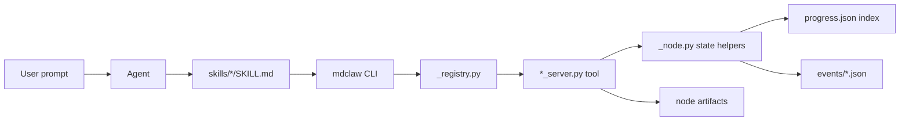
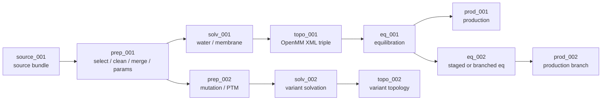
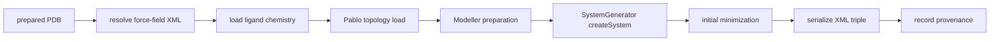
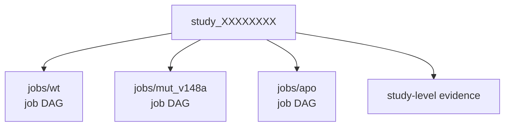

# MDClaw Developer Architecture

MDClaw provides skills and CLIs for vibe-MD simulations and autonomous
scientific investigation. The skills turn scientific intent into MD actions,
the Python tool modules do the work, and the node DAG records what actually
happened.

## Mental Model

| Layer | Responsibility | Main Files |
|---|---|---|
| Skill layer | Agent-facing MD decision policy and procedures | `skills/`, `.agents/skills/`, `.claude/skills/` |
| CLI and dispatch | Parse command-line calls, discover tools, inject node context | `bin/mdclaw`, `mdclaw/_cli.py`, `mdclaw/_registry.py` |
| Tool execution | Fetch structures, prepare systems, build OpenMM XML, run MD, analyze output | `mdclaw/*_server.py` |
| State and evidence | Record node status, artifacts, events, and reports | `mdclaw/_node.py`, `mdclaw/_event.py`, `mdclaw/evidence_server.py` |
| Distribution | Package skills and runtime for users | `.claude-plugin/`, `hooks/`, `container/`, `scripts/` |

The key design split is:

- **Skills translate scientific intent into tool choices.**
- **Tools run it and record state.**
- **The DAG is the source of truth for workflow progress.**
- **Study planning records the scientific question, MD goal, planned jobs,
  analysis intent, and decision criteria without replacing per-job DAG state.**

Deployment details live in `docs/agents/deployment.md`.

## Request Path

A normal skill-driven request follows this path:



Important boundaries:

- `skills/*/SKILL.md` should contain scientific decision policy and tool-use
  procedure, not hidden state mutation logic.
- `_cli.py` is the common entry point for direct users and agents.
- `_registry.py` maps public tool names to `mdclaw/*_server.py` functions.
- Workflow tools receive `job_dir` and `node_id`, then call `begin_node`,
  `complete_node`, or `fail_node`.
- `progress.json` is a thin index. Each node owns its durable details in
  `nodes/<node_id>/node.json` and `nodes/<node_id>/artifacts/`.

## Repository Map

| Path | Role |
|---|---|
| `skills/` | Source-of-truth MDClaw skills. |
| `.agents/skills/` | Generic Agent Skills discovery surface, normally symlinked to `skills/`. |
| `.claude/skills/` | Repo-local Claude Code skill discovery surface, normally symlinked to `skills/`. |
| `.claude-plugin/` | Claude plugin marketplace metadata. |
| `hooks/` | Plugin lifecycle hooks, including packaged runtime setup. |
| `bin/mdclaw` | Runtime wrapper that selects conda, SIF, Docker, or local CLI. |
| `mdclaw/` | Python package, CLI dispatch, server tools, state helpers. |
| `container/` | Docker image and Singularity/Apptainer SIF build assets for the packaged MD runtime. |
| `scripts/` | Setup, doctor, release, and maintenance scripts. |
| `benchmarks/mdagentbench/` | Benchmark prompts, scorer-only metadata, and truth artifacts. |
| `docs/` | User, agent, developer, benchmark, and research documentation. |
| `tests/` | Unit, smoke, benchmark scorer, and integration tests. |

## Core Python Modules

| Module | Responsibility |
|---|---|
| `_common.py` | Logging, directories, command wrappers, guardrails, shared helpers. |
| `_registry.py` | Server registry used by CLI discovery. |
| `_cli.py` | CLI entry point, JSON input handling, global `--job-dir` / `--node-id` injection. |
| `_node.py` | Schema v3 node DAG management, artifact registration, status transitions. |
| `_event.py` | Append-only JSON event log. |
| `_lock.py` | File-based locking with `fcntl.flock`. |
| `*_server.py` | Public tool modules. Each exposes a `TOOLS` dict. |

## Job DAG

The study layer is the normal outer record for a scientific question. A simple
one-system request can still be represented as a study with one job, usually
`jobs/main`; broader investigations register multiple job DAGs under the same
study.

Inside a job, the `source` node records a structural source bundle. The
required execution contract is `source_bundle.json` plus normalized
`artifacts/candidates/candidate_*.pdb|cif` files. Raw input files may also be
kept for provenance, but `prep` always selects one candidate file before
producing an MD-ready physical system. Candidate files can come from ordinary
single structures, NMR models split out of a multi-model PDB/mmCIF, PDB
assembly/chain choices, or generated prediction ensemble members from
Boltz/BioEm-like tools. Generator-specific rank and confidence data live on
the relevant candidate records and are surfaced through `list_source_candidates`.
Variants then branch from `prep`, `solv`, `topo`, `eq`, or `prod`.



Node artifacts are intentionally local to each node:

| Node Type | Typical Artifacts |
|---|---|
| `source` | `source_bundle.json`, normalized `candidates/candidate_*` files, optional raw downloaded/copied/generated structures, source metadata, optional `inspection.json`. |
| `prep` | `source_selection.json`, cleaned/merged PDB, `chain_identity_map.json`, `ligand_chemistry.json`, `residue_mapping.json`, branch-specific prepared structures. |
| `solv` | `solvated.pdb`, `box_dimensions.json`, membrane metadata when applicable. |
| `topo` | `system.system.xml`, `system.topology.pdb`, `system.state.xml`, force-field provenance. |
| `eq` | `equilibrated.pdb`, `equilibrated.xml`, `equilibrated.chk`, stage logs. |
| `prod` | `trajectory.dcd`, `final_structure.pdb`, `state.xml`, `checkpoint.chk`, `energy.dat`. |

The on-disk shape is:

```text
job_XXXXXXXX/
  progress.json
  progress.lock
  nodes/
    source_001/
      node.json
      node.lock
      artifacts/
        source_bundle.json
        1AKE.cif
        candidates/
          candidate_001.cif
          candidate_002.cif
    prep_001/
      node.json
      node.lock
      artifacts/
        source_selection.json
    solv_001/
      node.json
      node.lock
      artifacts/
    topo_001/
      node.json
      node.lock
      artifacts/
    eq_001/
      node.json
      node.lock
      artifacts/
    prod_001/
      node.json
      node.lock
      artifacts/
  events/
    <ISO8601>_<node_id>_<event_type>.json
```

DAG invariants:

- Parent-child relationships are stored in each node's `parent_node_ids`.
- Workflow nodes require both `job_dir` and `node_id`.
- Tools should auto-resolve inputs from ancestors when that is the documented
  contract.
- A completed topology node must provide the full OpenMM XML triple; run-side
  tools do not fall back to legacy Amber `parm7/rst7`.
- Events are append-only files, not a shared JSON array.
- Broken or unsupported chemistry should surface as structured errors rather
  than silent best-effort topology builds.

## State Files

| File | Purpose |
|---|---|
| `progress.json` | Thin job index: node list, cached summaries, current high-level state. |
| `nodes/<node_id>/node.json` | Authoritative node record: status, parents, artifacts, conditions, metadata. |
| `nodes/<node_id>/node.lock` | Per-node lock for concurrent-safe updates. |
| `nodes/<node_id>/artifacts/` | Tool-owned outputs registered by that node. |
| `events/*.json` | Append-only operational history. |

When debugging, start with the relevant node's `node.json`, then inspect its
registered artifacts and nearby event files. Do not infer workflow state from
loose files in the repository root.

## Topology Build Path

The recommended topology path is `build_amber_system`. It emits the modern
OpenMM triple consumed by equilibration and production:

```text
system.system.xml
system.topology.pdb
system.state.xml
```

The high-level topology pipeline is:



Stages recorded under `topo_NNN/metadata.topology_build_stage_history` include:

```text
resolve_forcefield_xml -> pdbfixer_hydrogenation ->
load_ligand_molecules -> pablo_load -> system_generator_init ->
modeller_prepare -> system_generator_create_system -> initial_minimization ->
serialization -> collect_provenance -> completed
```

Standard ligand records are loaded from `ligand_chemistry` into OpenFF
Molecules. Topology resolves Amber geostd XMLs first and passes the remaining
ligands to `SystemGenerator` / `GAFFTemplateGenerator`. The prep-to-topology
ligand handoff is the `ligand_chemistry` artifact.

`build_openmm_system` is the research escape hatch for explicit custom OpenMM
XML. It emits the same XML triple, so downstream `eq` and `prod` nodes consume
both builders through the same contract.

## Study Directories

Use a `study_dir` for every new scientific question. For a single ordinary MD
run, register one job such as `jobs/main`. When the question spans multiple
systems, such as WT versus mutant or apo versus holo, register multiple
independent `job_dir`s under the same study.



```text
study_XXXXXXXX/
  study.json
  study_plan.json
  decisions.jsonl
  question_history.jsonl
  token_ledger.jsonl
  annotations/
  evidence/
  jobs/
    wt/
      progress.json
      nodes/source_001/...
    mut_v148a/
      progress.json
      nodes/source_001/...
```

`study_server.py` manages the study index and lightweight study plans. It does
not execute OpenMM or mutate node DAG semantics. Each registered job owns its
node DAG and source bundle; the study records cross-job intent, roles,
decisions, planned analyses, and evidence.

`study_plan.json`, when present, is intentionally small and weak-agent friendly.
It records the minimum needed to reconnect results to intent:

```json
{
  "question": "scientific question",
  "md_goal": "what MD should test",
  "jobs": [{"job_id": "main", "purpose": "why this job exists"}],
  "analysis": ["observables to inspect"],
  "decision": {
    "support": "what would support the question",
    "against": "what would argue against it",
    "inconclusive": "what would leave it unresolved"
  }
}
```

For clear one-system requests such as "simulate 1AKE chain A", the direct path
through `md-prepare` remains valid. Such runs may still use a study with
`jobs/main`, but they do not require `study_plan.json`.

## Adding Tools

To add a new CLI tool:

1. Add a plain Python function in the relevant `mdclaw/*_server.py`.
2. Add it to that module's `TOOLS` dict.
3. Register a new server in `_registry.py` only if you created a new module.
4. Add focused tests for registration, argument handling, and behavior.
5. Update the relevant `skills/*/SKILL.md` examples if users or agents should
   call the new tool.
6. Update `docs/developer/tool-reference.md` when the public contract changes.

Keep state mutation in tools, not in skills. If a tool participates in the DAG,
make its artifact registration and structured failure codes explicit.
