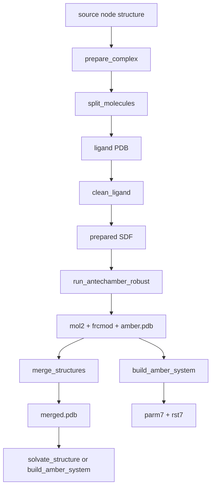

# Ligand Robustness Audit

Date: 2026-05-01

> **Legacy note (2026-09 update)**: This audit was written before the
> openmmforcefields-unification refactor. References to `tleap`, `parm7`,
> `rst7`, `loadamberparams`, and `loadmol2` describe the *legacy* topology
> path. `build_amber_system` now emits the modern artifact triple
> `system.xml` + `topology.pdb` + `state.xml` via
> `openmmforcefields.SystemGenerator` + `GAFFTemplateGenerator` (with
> OpenFF Pablo for topology); ligands flow in as `openff.toolkit.Molecule`
> objects. The structural concerns about `UNL` repair, `frcmod` validation,
> and `ligand_params.json` provenance still hold — they apply to the
> validators upstream of the System builder regardless of the post-stage
> implementation. See `AGENTS.md` `### amber_server.py` and
> `docs/developer/tool-reference.md` for the current contract.

## Scope

This audit reviews the current ligand path from structure preparation to Amber
topology generation. It does not change production behavior. The goal is to
identify where an apparently successful run could still produce a scientifically
questionable ligand model, then define concrete validation invariants and a
small hardening roadmap.

Reviewed components:

- `mdclaw/structure_server.py`
  - ligand discovery and splitting
  - `clean_ligand`
  - `run_antechamber_robust`
  - `prepare_complex`
- `mdclaw/amber_server.py`
  - `validate_ligand_params`
  - `fix_ligand_residue_names`
  - `build_amber_system`
- `mdclaw/_node.py`
  - `ligand_params` artifact propagation from `prep` to `topo`
- `tests/test_ligand_pathway.py`
  - existing ligand-pathway coverage

## Current Flow

The intended ligand flow is:



### Positive Properties

- Bond orders are not inferred only from PDB connectivity. `clean_ligand`
  obtains a SMILES template from user input, CCD, or a local dictionary, then
  uses RDKit template matching.
- Protonation and charge are explicitly surfaced. `clean_ligand` records
  pH, SMILES source, formal charge, calculated net charge, and warnings.
- Parameterization prefers curated CCD-derived parameters when available.
  `run_antechamber_robust` checks `amber_geostd` before falling back to GAFF2.
- Metal-containing ligands hard-fail before GAFF. This is the correct policy:
  GAFF should not silently parameterize metal centers.
- `frcmod` is parsed for dangerous missing parameters. Zero BOND/ANGLE force
  constants are treated as errors, and zero DIHE/IMPROPER barriers produce
  structured failures.
- Blocking ligand failures are surfaced at workflow level through
  `overall_status="completed_with_blocking_ligand_failure"` and
  `workflow_recommendation`.
- In DAG mode, `ligand_params` is a structured artifact on the `prep` node and
  is auto-resolved by `build_amber_system` for the `topo` node.

## Main Risks

### 1. Bound Pose Preservation

`prepare_complex` defaults `optimize_ligands=True`, which is passed into
`clean_ligand`. `clean_ligand` can run MMFF94 optimization and then writes the
optimized SDF. The later `run_antechamber_robust` output PDB is preferred during
merge.

This is risky for protein-ligand complexes because the crystallographic or
predicted bound pose is the meaningful starting pose. A local MMFF optimization
without receptor constraints can move heavy atoms away from the binding pose.

Audit severity: high.

Recommended invariant:

- Heavy-atom RMSD between input ligand PDB and final ligand `amber.pdb` should
  be below a strict threshold by default, for example 0.1 to 0.3 A.
- If optimization is enabled and the RMSD exceeds the threshold, stop or require
  explicit user confirmation.
- For bound ligands, the safe default should be preserving heavy-atom
  coordinates and only adding hydrogens / assigning bond orders.

### 2. Missing Round-Trip Validation

There is no single validator that checks the ligand through this sequence:

```text
input PDB -> prepared SDF -> mol2/frcmod -> amber.pdb -> merged.pdb -> tleap
```

The current code validates pieces independently, but it does not assert that
the same ligand survived the whole path with the same heavy atoms, residue
identity, charge, and coordinates.

Audit severity: high.

Recommended invariant:

- Heavy atom count is unchanged across input PDB, SDF, mol2, and amber PDB.
- Heavy atom element multiset is unchanged.
- Residue name is stable and matches `ligand_params[].residue_name`.
- `mol2` total partial charge is close to `charge_used`, for example
  `abs(sum(charges) - charge_used) < 0.05`.
- The final merged PDB contains all successful ligands and no failed ligands.
- The generated tleap script includes one `loadamberparams` and one `loadmol2`
  entry per ligand parameter set.

### 3. Ambiguous UNL Repair

`amber_server.fix_ligand_residue_names` replaces every `UNL` residue with the
first ligand residue name. The function itself has a TODO for multiple ligand
support.

This can corrupt multi-ligand systems if packmol-memgen or other tools produce
`UNL` for more than one ligand type. The wrong residue name can make tleap bind
the wrong template to atoms with incompatible names or charges.

Audit severity: high for multi-ligand systems; medium for single-ligand systems.

Recommended invariant:

- If more than one ligand residue name exists and `UNL` appears, do not guess.
  Stop with a deterministic error that asks for explicit mapping.
- If exactly one ligand residue exists, `UNL` replacement is acceptable but
  should record which atom lines/residues were changed.

### 4. Topology Preflight Is Too Permissive

`validate_ligand_params` collects missing `mol2` or `frcmod` files as errors,
but `build_amber_system` currently appends them as warnings and continues. That
eventually fails in tleap, but the failure is delayed and noisier.

Audit severity: medium-high.

Recommended invariant:

- If the caller supplied non-empty `ligand_params` and any entry is invalid,
  `build_amber_system` should fail before writing/running tleap.
- If `ligand_params` is absent but ligands are present in `pdb_file`, topology
  should warn or fail depending on policy. Silent protein-only topology with
  unparameterized HETATM ligand records is not acceptable.

### 5. Charge Confidence Is Visible But Not Fully Enforced

The pathway surfaces `LOW_CONFIDENCE_CHARGE`, known cofactor overrides, and
manual charge overrides. However, the code does not yet enforce a complete
charge consistency contract across `clean_ligand`, `run_antechamber_robust`,
and `mol2` output.

Audit severity: medium.

Recommended invariant:

- `charge_source` and `charge_confidence` should be propagated into each
  ligand result and into `ligand_params` metadata.
- `mol2` charge sum should match `charge_used`.
- Known cofactor charge overrides should be recorded as such, not just warning
  text.
- Manual charge overrides should be recorded with provenance, including user
  supplied value and ligand id.

### 6. Coverage Is Not Yet a Scientific Regression Suite

`tests/test_ligand_pathway.py` is useful and already covers many guardrails:
frcmod parsing, charge lookup, workflow status, geostd lookup, mocked geostd
integration, and some AmberTools integration for acetic acid.

The missing coverage is more scientific than syntactic:

- real PDB protein-ligand complex with a known small organic ligand
- charged ligand
- polyphosphate cofactor
- geostd hit with coordinate transplant validation
- multiple chemically distinct ligands
- metal-containing cofactor hard failure
- solvate -> topo -> OpenMM finite-energy smoke

Audit severity: medium.

## Validation Invariants

### Pose Invariants

- Preserve heavy atom coordinates for bound ligands by default.
- Compute heavy-atom RMSD for:
  - input ligand PDB vs prepared SDF
  - input ligand PDB vs final `amber.pdb`
  - final `amber.pdb` vs ligand atoms in merged PDB
- Flag RMSD above threshold as a blocking issue unless explicitly allowed.

### Identity Invariants

- Heavy atom count and element multiset must be stable across conversions.
- Atom names used in final PDB should be compatible with `mol2` atom names.
- Residue name in final PDB should match `ligand_params[].residue_name`.
- Multiple ligands with the same residue name but different coordinates should
  remain separate instances, not merged into one template assumption without
  provenance.

### Charge Invariants

- `charge_used` should be an integer and should match the mol2 partial charge
  sum within tolerance.
- `charge_confidence` should be one of a documented set:
  - `manual`
  - `dimorphite`
  - `known_cofactor`
  - `geostd_curated`
  - `default`
- Low-confidence charge must remain a stop-and-ask condition in skills.

### Parameter Invariants

- No zero BOND/ANGLE force constants.
- No zero DIHE/IMPROPER barriers unless a documented policy explicitly allows
  them for the ligand class.
- `amber_geostd` hits should include successful coordinate transplant or else
  fall back to GAFF2.
- Each successful ligand should have mol2, frcmod, and amber PDB artifacts.

### Topology Invariants

- `build_amber_system` should fail before tleap when ligand params are declared
  but invalid.
- The tleap script should load `frcmod` before `mol2`.
- The structure PDB passed to `loadpdb` should contain only ligand residue names
  that have corresponding loaded templates, except for ions handled by Amber.
- The resulting topology should contain ligand residues with expected counts.

### DAG Invariants

- `prepare_complex` should register `ligand_params` on the prep node only for
  ligands that passed validation.
- `build_amber_system` should auto-resolve `ligand_params` from the nearest
  completed prep ancestor.
- Failed ligand parameterization should not produce partial or stale artifacts
  that downstream nodes can accidentally consume.

## Recommended Hardening Roadmap

### Priority 1: Add Ligand Round-Trip Validator

Add a focused validator, likely in `structure_server.py`, that runs after
`run_antechamber_robust` and before marking a ligand successful in
`prepare_complex`.

Suggested API:

```python
validate_ligand_roundtrip(
    input_pdb: str,
    prepared_sdf: str,
    mol2: str,
    amber_pdb: str,
    residue_name: str,
    expected_charge: int | None,
) -> dict
```

It should return structured fields:

- `success`
- `heavy_atom_count_match`
- `element_multiset_match`
- `heavy_atom_rmsd`
- `residue_name_match`
- `charge_sum`
- `charge_matches_expected`
- `errors`
- `warnings`

The first implementation can be conservative and only hard-fail clear
corruption: atom count mismatch, element mismatch, missing amber PDB, or large
heavy-atom RMSD.

### Priority 2: Preserve Bound Pose By Default

Change policy so bound ligands preserve heavy-atom coordinates by default.
Options:

- set `optimize_ligands=False` in `prepare_complex`
- or keep the argument default but have skills pass `--no-optimize-ligands`
- or constrain optimization to hydrogens only

The cleanest scientific default is: assign bond orders, add hydrogens, compute
charges, but do not move heavy atoms unless explicitly requested.

### Priority 3: Make Ambiguous UNL Replacement Blocking

Update `fix_ligand_residue_names` policy:

- zero ligand names: copy unchanged
- one ligand name: replace `UNL` and record provenance
- two or more ligand names: if `UNL` appears, return structured error instead
  of replacing everything with the first name

### Priority 4: Fail Fast On Invalid Ligand Params

In `build_amber_system`, invalid explicitly supplied or auto-resolved ligand
params should be deterministic validation errors, not warnings. This avoids
cryptic downstream tleap failures.

### Priority 5: Add Regression Cases

Add tests in layers:

- Level 1 unit tests for the round-trip validator with synthetic PDB/SDF/mol2.
- Level 2 RDKit tests for pose preservation and charge sum checking.
- Level 3 integration tests using AmberTools for at least one real small ligand
  complex and one geostd hit.
- Optional slow test: build topology and run a minimal OpenMM energy check to
  ensure finite energies.

## Suggested Decision

The most important immediate change is not broader GAFF automation; it is
making the current pathway prove that it preserved the ligand identity and
pose. The recommended next implementation is therefore:

1. Add `validate_ligand_roundtrip`.
2. Preserve bound ligand heavy atoms by default.
3. Fail fast on ambiguous `UNL` and invalid ligand params.
4. Add small regression tests around those invariants.

This keeps the codebase aligned with the current design while directly
addressing the risk that a run can complete with chemically or geometrically
incorrect ligand input.
