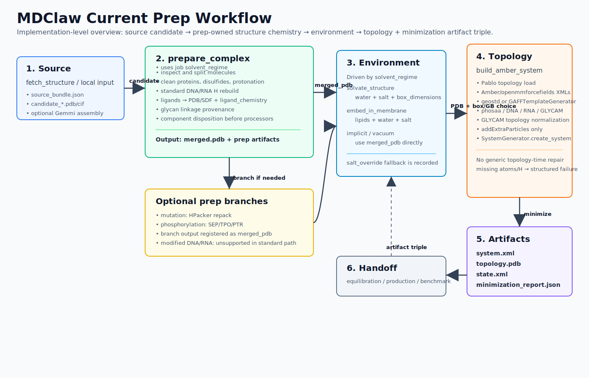
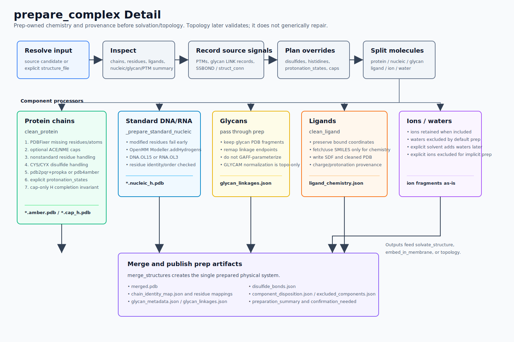
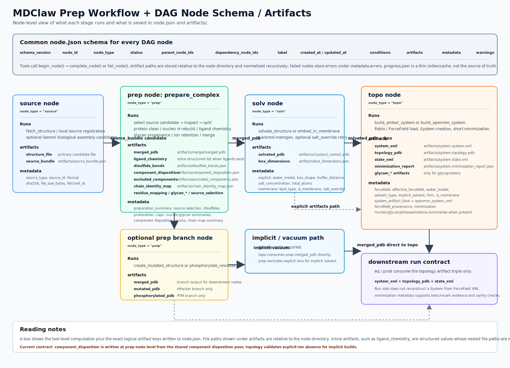
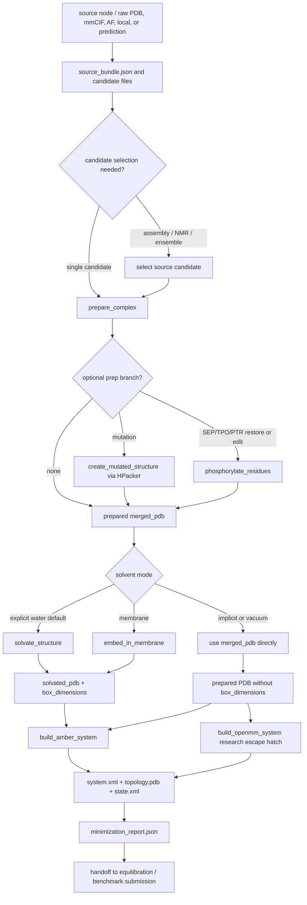
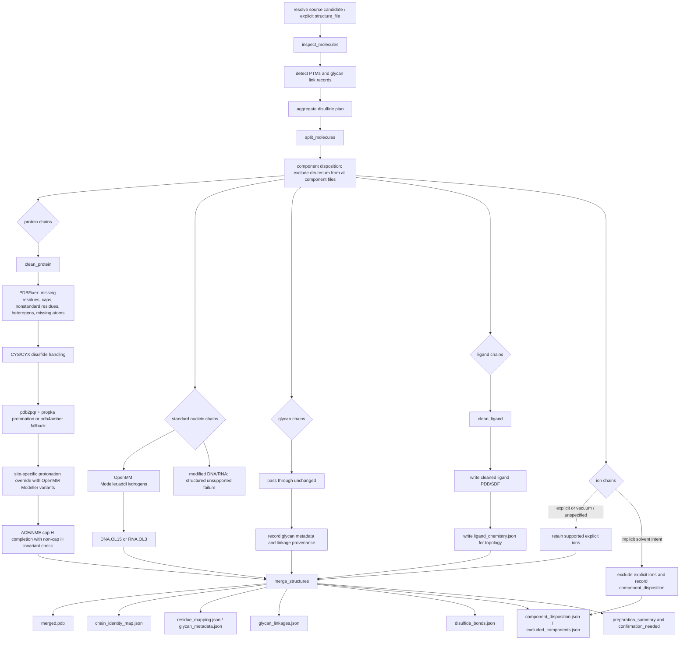
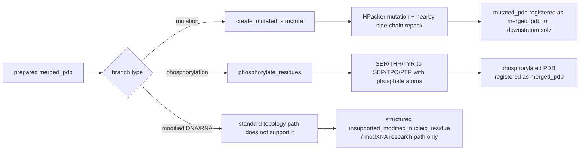
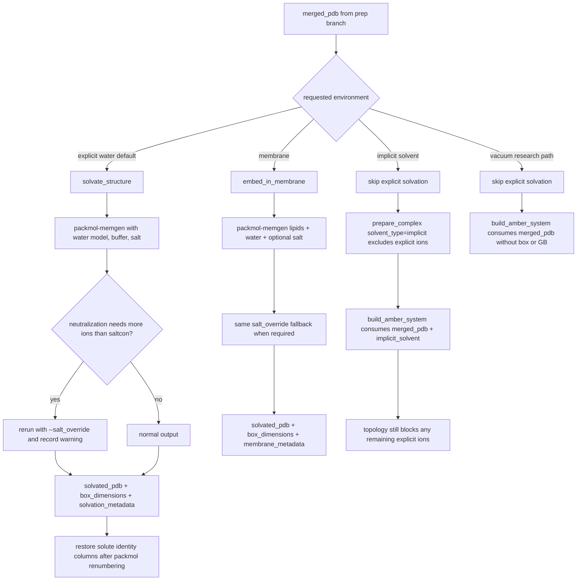
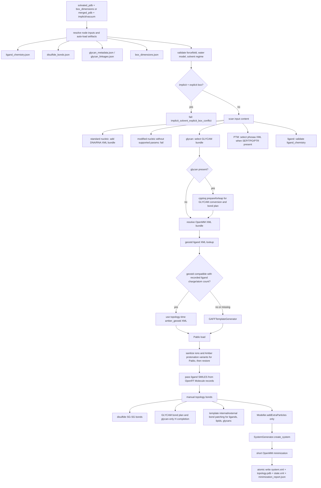
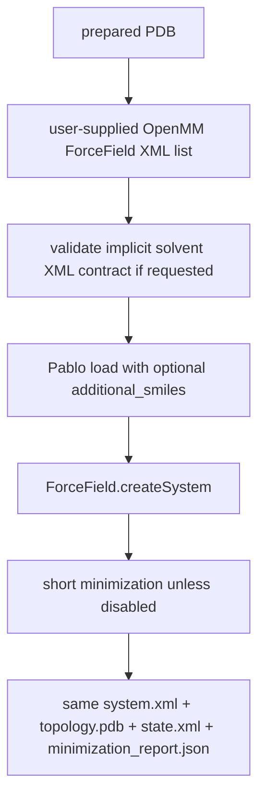

# MDClaw Prep Workflow Flowchart

Date: 2026-05-20

This note summarizes the current MDClaw preparation implementation as read
from `skills/md-prepare/SKILL.md`, `mdclaw/structure_server.py`,
`mdclaw/solvation_server.py`, `mdclaw/amber_server.py`,
`mdclaw/openmm_system_server.py`, and the developer tool reference. It is a
flowchart-oriented map for future refactors and benchmark discussions.

Rendered SVG diagrams:

- [Prep workflow overview](prep_workflow_overview.svg)
- [prepare_complex detail](prep_workflow_prepare_complex_detail.svg)
- [Prep DAG schema and artifacts](prep_workflow_dag_schema_artifacts.svg)

## Scope

"Prep" in the user-facing workflow spans four implementation layers:

1. source normalization and candidate selection,
2. `prepare_complex` and optional prep branches,
3. solvation or membrane embedding,
4. topology build plus short minimization evidence.

The important contract boundary is that atom identity, residue identity,
protonation, terminal caps, standard nucleic hydrogens, ligand chemistry, and
component disposition are prep-owned. Topology builders do not run generic
PDBFixer repair or generic `Modeller.addHydrogens`; they validate the prepared
input, add force-field-required extra particles, apply topology-only specialty
normalization where needed, and serialize the OpenMM artifact triple.

## High-Level Flow

## `prepare_complex` Detail

Implementation anchors:

- `prepare_complex(...)` starts at `mdclaw/structure_server.py:4864`.
- `clean_protein(...)` starts at `mdclaw/structure_server.py:2148`.
- Standard nucleic H rebuild is in `_prepare_standard_nucleic(...)` at
  `mdclaw/structure_server.py:3680`.
- Terminal cap H completion is in
  `_complete_terminal_cap_hydrogens_with_modeller(...)` at
  `mdclaw/structure_server.py:3524`.
- Deuterium/component disposition starts with
  `_is_deuterium_atom_record(...)` and
  `_exclude_deuterium_atoms_from_pdb(...)` near
  `mdclaw/structure_server.py:102`, and is applied to split component files
  before component-specific preparation.
- `merge_structures(...)` starts at `mdclaw/structure_server.py:3919`.

## Optional Prep Branches

`create_mutated_structure(...)` starts at
`mdclaw/structure_server.py:6317`, and `phosphorylate_residues(...)` starts at
`mdclaw/structure_server.py:6975`.

## Solvation And Membrane Layer

Implementation anchors:

- `solvate_structure(...)` starts at `mdclaw/solvation_server.py:627`.
- `embed_in_membrane(...)` starts at `mdclaw/solvation_server.py:1096`.
- Salt override fallback is implemented in
  `_record_salt_override_fallback(...)` near
  `mdclaw/solvation_server.py:413`.
- Solute identity restoration is implemented in
  `_restore_packmol_solute_identity(...)` near
  `mdclaw/solvation_server.py:459`.

## Curated Topology Layer: `build_amber_system`

Implementation anchors:

- `build_amber_system(...)` starts at `mdclaw/amber_server.py:2577`.
- GLYCAM prepareforleap is in `_prepare_glycam_pdb_with_cpptraj(...)` at
  `mdclaw/amber_server.py:2389`.
- GLYCAM bond-plan parsing and normalization are in
  `_parse_glycam_leap_bond_plan(...)`,
  `_resolve_glycam_bond_endpoint_residue(...)`, and
  `_normalize_glycam_topology(...)` at
  `mdclaw/amber_server.py:718`, `mdclaw/amber_server.py:869`, and
  `mdclaw/amber_server.py:985`.
- The openmmforcefields/Pablo helper starts at
  `mdclaw/amber_server.py:4038`.

## Research Escape Hatch: `build_openmm_system`

`build_openmm_system(...)` starts at `mdclaw/openmm_system_server.py:175`.
It is intentionally less opinionated than `build_amber_system`: the user
brings XMLs that are already trusted, while MDClaw still emits the same atomic
artifact triple for downstream run tools.

## Current Design Boundaries

- `source` owns raw source normalization and optional Gemmi biological assembly
  generation. `prep` selects one candidate before making a physical MD system.
- `prepare_complex` owns component selection, component-common disposition
  (including deuterium exclusion for all split components and optional
  implicit-solvent ion exclusion), cleaning, protonation, standard DNA/RNA H
  rebuild, terminal caps, ligand chemistry artifacts, disulfide provenance,
  and glycan provenance.
- `solvate_structure` and `embed_in_membrane` own explicit environment
  construction and `box_dimensions`. Their output is the only explicit-solvent
  input expected by topology.
- `build_amber_system` owns force-field XML selection, topology-time ligand
  template selection, GLYCAM topology normalization, force-field validation,
  extra particles, system creation, and short minimization evidence.
- Generic repair at topology time is intentionally absent. If atom/H
  completeness is wrong, topology should fail with a structured code rather
  than silently repairing the prepared PDB.
- The run-side contract is only the atomic OpenMM artifact triple:
  `system.xml`, `topology.pdb`, and `state.xml`, plus minimization metadata
  where relevant. Equilibration and production consume that triple and do not
  reconstruct systems from ForceField XML.

## Main Artifacts By Stage

| Stage | Main artifacts |
|---|---|
| source | `source_bundle.json`, `artifacts/candidates/candidate_*` |
| prepare_complex | `merged.pdb`, `prepare_complex_summary.json`, `chain_identity_map.json`, `residue_mapping.json`, `disulfide_bonds.json`, `component_disposition.json`, `excluded_components.json`, optional `ligand_chemistry.json`, optional `glycan_metadata.json`, optional `glycan_linkages.json` |
| mutation branch | `mutated.pdb` registered as downstream `merged_pdb` |
| phosphorylation branch | `phosphorylated.pdb` registered as downstream `merged_pdb` |
| explicit solvation | `solvated.pdb`, `box_dimensions.json`, `solvation_metadata.json` |
| membrane embedding | `membrane.pdb`, `box_dimensions.json`, `membrane_metadata.json` |
| topology | `system.system.xml`, `system.topology.pdb`, `system.state.xml`, `system.minimization_report.json`, `amber_metadata.json`, optional `system.glycam_bond_plan.json`, optional `system.glycam_normalization.json` |
