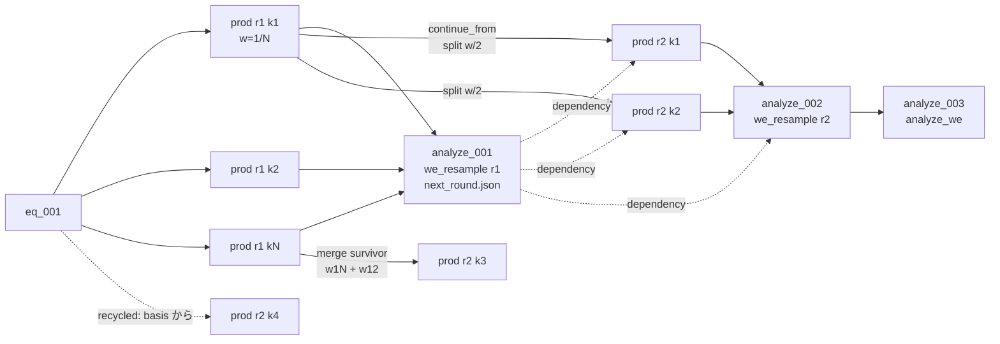

# Round 駆動サンプリング（replica / Weighted Ensemble）を DAG に載せる実装計画

作成: 2026-09-21（ユーザー案を Claude が MDClaw のコードを実地調査して具体化。同日、
「WE 専用仕様を避け、既存 DAG を使い、他の MD 手法にも使い回せる形に」というユーザー方針で
汎用の round 駆動 + WE は policy の一つ、に組み替えた。実装前のレビュー用）

## 0. 用語とユーザー案との対応

| 用語 | 意味 |
| --- | --- |
| replica / walker | 1 本の軌道。WE では重みを持つ |
| round（反復） | 全 replica を τ だけ進め、次の batch を決める 1 周 |
| segment（区間） | 1 round 分の 1 replica の軌道片。**segment = `prod` ノード 1 個** |
| batch | 1 round の `prod` ノード集合 |
| scheme | round 駆動の定義（policy、τ、replica 数、開始ノード、実行方法）。`progress.json.params.sampling_schemes[<id>]` |
| policy | round の終わりに次の batch を決める規則。`replicas`（全部続ける、内蔵）または analyze ツール（`we_resample` …）が `next_round.json` を書く |

| ユーザー案 | 本計画 |
| --- | --- |
| prod ノードに weight を保存 | segment ノードの `conditions.weight`（作成時、plan の写し）と `metadata.weight`（完了時）。台帳は policy ノードの `next_round.json` |
| 分裂したら weight も分裂 | `we_resample` が子 spec（親、開始 state、重み、seed）を `next_round.json` に書き、`run_rounds` がそこから子ノードを `continue_from=<親>` + `dependency_node_ids=[policy ノード]` で作る |
| 分裂の判断は prod 群を親にした analysis ノードで | round ごとに analyze ノード 1 個。親 = その round の segment 全部（`create_node` は複数 prod 親を既に許す）。`analysis_data_scope: segment` |
| 末端の analysis ノードで WE 解析、fitting で kinetics | `analyze_we`。親 = policy ノード（analyze→analyze 親は許可済み）。§7 |
| `run_we` は replica でも使えると便利 / 既存 DAG を使い、他手法にも | ドライバは `run_rounds`（policy 非依存）。`--policy replicas` で「N seed × k 継続」を local でも MPS でも回す。WE 固有は `we_resample` と `analyze_we` だけ（§5） |

---

## 1. 方針

- 新ノード型・新 scope・新 state 形式を増やさない。`prod` / `analyze`、`continue_from`、`dependency_node_ids`、`conditions`、`update_job_params`、`submit_mps_job` / `submit_array_job` をそのまま使う。
- 「prod 群 → 解析 → 次の prod 群」の round を**汎用契約**にする。WE、単純 replica、SST2 の「適応ブロック → `analyze_tempering` → 固定重みブロック」、adaptive sampling（frame から再開）は全部この形。
- ガードレールは tool に置く（CLAUDE.md）。WE で「数値は出るが間違っている」失敗（同 seed の兄弟が同一軌道、重みの和 ≠ 1、揃う前に resample、target 未到達で rate）は `code` 付きで拒否。
- 目的（科学）: 遷移の速度定数と MFPT を無バイアスの力学から得る。対象は (i) ペプチド・小タンパクの折り畳み（pcoord: q / rmsd）、(ii) 構造変化（pcoord: 状態 A と B の参照構造への RMSD の 2 次元、または dihedral。target = B の近傍）、(iii) リガンドの解離・結合（pcoord: 分子間距離 + リガンド RMSD、k_off と濃度規格化した k_on）。

---

## 2. コードの事実（2026-09-21 調査、設計を縛るもの）

| # | 事実 | 影響 |
| --- | --- | --- |
| 1 | `create_node(parent_node_ids, dependency_node_ids, label, conditions, continue_from)`。metadata は `continued_from` だけ。1 回ごとにロック + `progress.json` 全書き換え + `explain_node` preflight（`node/lifecycle.py:243`） | 10⁴ ノード（4 MB）で 1 round 100 ノード ≈ 10–20 s。MD が数分/round なら許容。一括版は実測で要るときに（v1.5） |
| 2 | `_ALLOWED_PARENT_TYPES`: `prod ← {eq, prod}`、`analyze ← {prod, fep, analyze}`。analyze の複数 prod 親は `branches_input`。`dependency_node_ids` は実行時に completed 必須（`validate_node_execution_context`） | round の形はそのまま作れる。子 segment の `dependency_node_ids=[policy ノード]` で「plan 確定後に走る」を tool が保証 |
| 3 | `_resolve_md_restart`: `continued_from` 最優先、`state` → `checkpoint`。`read_ancestor_final_step` が step を復元 | 子 segment は `continue_from=<親 segment>`。basis から再開する子（再循環）は親を basis ノード（`eq` または `prod`）にする |
| 4 | `run_production` のシード: `_restart_random_seed(random_seed, restart_step)`（`production.py:760`）。同じ親・同じ seed の兄弟は**同一シード → 同一軌道** | replica でも WE でも致命的。`propagate_batch` は node ごとの `random_seed` を必須にし、`run_production` に兄弟衝突ガード |
| 5 | `_load_state_into_simulation` は `.xml` / `.chk`。positions / velocities / box のみ転送 | state 形式は変えない。7 万原子で XML 8–10 MB、保存 ≈ 1 s |
| 6 | `_walk_prod_chain_from` は `continued_from` → 最初の親を辿り prod 以外で止まる | replica / walker の系譜は `concat_trajectory` でそのまま連結できる |
| 7 | `dag_snapshot` は `completed` 全 id を列挙し、`dag` は PROTECTED（`node/snapshot.py`、`_envelope.py`） | 10⁴ ノードで毎回 MB 級の出力。上限を入れる（汎用） |
| 8 | `submit_job(script=<コマンド文字列>)` はノード無しで投げられる。`submit_mps_job` / `submit_array_job` の task は `node_id` 必須 | executor `mps` / `array` は task = segment ノード（現行契約そのまま）。ドライバ自身は `submit_job --script` で投げられる |
| 9 | 共有 SIF: OpenMM 8.5.1（`DCDReporter(..., atomSubset=None)`）、scipy 1.18、mdtraj 1.11.1、pymbar 4.2 | solute だけの DCD、`curve_fit`、mdtraj の rmsd / dihedral / 接触 |
| 10 | `analyze_tempering`: 親 prod 群を自前で集め `verdict` と `_frames.csv`。`run_sst2`: `@node_tool("prod")`、`validate_node_execution_context(actual_conditions=…)`、sidecar | 同じ型で書く |
| 11 | code はキーワード形 `code="…"`（scanner）。golden: `tests/data/guardrail_codes.json`、`cli_contract.json`。`test_registry.py` は server 数 17 | 新 server `rounds`（仮）で 18 |
| 12 | 1KXV（71k 原子）GB200 単独 ≈ 820 ns/day、MPS 8 本で集計 2.65 倍（52k 原子） | τ = 50 ps ≈ 5 s/segment（local-batch）。プロセス起動 10–20 s なので executor `mps` は τ ≳ 200 ps |
| 13 | `run_production` は 1 ノードにつき `runtime_system.xml`（≈ 10 MB）と全原子 DCD を書く | 短い segment を大量に作るなら batch で共有・solute だけの DCD に |

---

## 3. 汎用部品（replica / WE / 将来の adaptive で共用）

### 3.1 scheme（`params.sampling_schemes[<id>]`、`setup_rounds` が検証して記録）

```json
{
  "scheme_id": "h3flip",
  "policy": "weighted_ensemble",            // "replicas" | "<analyze tool name>"
  "policy_args": {...},                       // policy ツールへ渡す（WE: pcoord, bins, walkers_per_bin, target, recycle）
  "stage_tool": "run_production",             // segment を走らせる tool（run_sst2 も可）
  "stage_args": {"simulation_time_ns": 0.05, "pressure_bar": 1.0, "output_frequency_ps": 10,
                 "trajectory_selection": "protein", "platform": "CUDA"},
  "start": {"node_ids": ["eq_001"], "n_replicas": 20},   // replicas: seed 違い n 本。WE: bin あたり M 本
  "seed": 20260921,
  "retention": {"prune_states_after_rounds": null}      // 既定 null（消さない）
}
```

### 3.2 `run_rounds`（job レベル、policy 非依存、再入可能）

```
loop:
  batch = 未完了の segment があればそれ、無ければ前 round の next_round.json（round 1 は scheme）から create_node で作る
  propagate(batch, executor)      # local-batch | local | mps | array
  if policy != "replicas":
      analyze ノードを作り（親 = batch、dependency = 前 policy ノード）policy tool を走らせ next_round.json を得る
  stop? (--max-rounds / --max-aggregate-ns / --max-wall-hours / policy の stop 指示)
```

- executor `local`: 各 node の stage tool（既定 `run_production`）をこのプロセスで順に呼ぶ（§3.3）。`mps`: `submit_mps_job` に task = node で投げ、`--wait` で `check_job` を回して完了を待つ（Ala3 / chignolin の実測後に入れる）。`--chain`（次 round の `run_rounds` を `afterok` で自己投入）は v1.5。
- 再入: DAG だけを見る。pending segment は走らせる、failed segment は同じ親・同じ重み・新 seed の兄弟を作る（同じ系譜 3 回連続失敗で `rounds_replica_unstable`）、policy ノードが completed なら飛ばす。
- `--policy replicas`: analyze ノードなし。各 replica を `continue_from` で k 本繋ぐ。既存 `submit-mps.md` の bash ループの置き換え。
- 各 segment ノードの `conditions`: `scheme_id`, `round`, `replica`, `random_seed`, `parent_segment`（node id | null）, `weight`（policy が与えたとき）。label `"<scheme>:r<round>:<replica>"`。
- `retention.prune_states_after_rounds = K`（opt-in）: round 完了後、K round より古い segment の `state` を消し、ノードに `state_pruned` event、`_select_md_restart_ancestor` はファイル欠損時 `restart_state_pruned` を返す（next_action: 保持内の子孫から分岐、または最終フレームから速度を引き直す）。

### 3.3 segment の実行 = `run_production` をそのまま呼ぶ（2026-09-21 ユーザー判断）

新しい実行ツールは作らない。executor `local` はドライバのプロセス内で segment ごとに
`run_production(job_dir=…, node_id=…, random_seed=<node の条件>, …)` を関数呼び出しする。
executor `mps` は同じコマンドを `submit_mps_job` の task にする。

- オーバーヘッドの見積もり（プロセス内呼び出し）: Simulation 構築（CUDA context 1–3 s）+ XML 読み書き（小系 0.5 s、7 万原子で 2 s）≈ 2–4 s / segment。ペプチド・小タンパク（1–3 万原子、GB200 で 1–3 µs/day）なら τ = 100–200 ps で MD が 4–15 s、オーバーヘッドは 2–3 割。別プロセス（`mps`）は import が乗るので τ ≳ 200 ps。実測して skill に書く。
- ディスク: `run_production` は segment ごとに `runtime_system.xml`（小系 1–2 MB、7 万原子 10 MB）と `final_structure.pdb` を書く。10⁴ segment で 10–100 GB。小系なら許容、大きくなったら retention（opt-in）で消す。
- seed: segment の `random_seed` は `run_rounds` が (scheme seed, round, replica) から決めて条件に書き、`run_production` は `_restart_random_seed(seed, restart_step)` で兄弟ごとに異なる実効シードになる。手で作った兄弟が同じ seed で同一軌道になる事故は `run_production` 側の `production_sibling_seed_collision` で拒否。
- SST2 の round は同じ executor で `run_sst2` を呼ぶだけ（`stage_tool`）。

### 3.4 ノード id（フォルダ名）の規則

今の id は型ごとの連番 `<type>_<seq:03d>`（`_next_node_id`、非数値の接尾辞は無視する）。
scheme が作るノードは数が多いので、フォルダ名だけで scheme / round / replica が読める構造化 id にする。
連番 id と同居でき、`_next_node_id` の連番には影響しない。

| ノード | id | 例 |
| --- | --- | --- |
| 通常のノード | `<type>_<seq:03d>`（変更なし） | `prod_007` |
| scheme の segment | `<type>_<scheme>_r<round:04d>_w<replica:04d>` | `prod_h3flip_r0013_w0050` |
| scheme の policy ノード | `analyze_<scheme>_r<round:04d>` | `analyze_h3flip_r0013` |
| 末端解析 | 通常の連番 | `analyze_004` |

- `scheme_id` は `[a-z][a-z0-9]{0,15}`（小文字英数、下線なし）に限定して id の区切りを一意にする（`rounds_scheme_invalid`）。
- `r` = round、`w` = walker / replica の番号。`ls nodes/` が scheme → round → replica の順に並ぶ。
- 割当は `create_node` の非公開引数 `_node_id`（下線始まりは CLI に出ない。`run_rounds` だけが渡し、形式と一意性を検証する）。公開の `node_id` 引数は今までどおり拒否（エージェントが id を選ぶことはない）。
- 大きな DAG で id を列挙する箇所（`dag_snapshot`、`node_missing_error` の `existing_node_ids`、`parent_required` の候補、`describe_nodes`）には上限を入れる（Phase 0、汎用）。

### 3.5 その他の汎用変更

- `dag_snapshot`: 各リストは 40 件超で先頭 20 + 末尾 20 と件数（`truncated: true`）。`node_missing` の `existing_node_ids`、`parent_required` の候補も同じ上限。
- CV 評価 `mdclaw/analyze/cv.py`: `distance`（質量重心、分子内は raw・分子間は最小像。`restraints.resolve_centroid_groups` 再利用。分子間の target は半箱長未満に限る: `we_target_exceeds_half_box`）、`rmsd`（参照 PDB。`align_selection` で重ね合わせ、`selection` で測る: タンパク質で合わせてリガンドで測る形が解離・結合の pcoord）、`dihedral`（4 原子、`md.compute_dihedrals`）、`q`（Best–Hummer–Eaton の天然接触割合）。軌道（DCD + topology）から frame ごとに評価。折り畳みには rmsd / q、解離・結合には distance + rmsd が要るので 4 種とも v1。
- solute だけの DCD（`--trajectory-selection`）は小系では要らない（1 万原子 × 1 frame/segment × 10⁴ = 1.2 GB）。大きな系で必要になったら `run_production` の汎用オプションとして足す。

---

## 4. DAG の形（WE の場合）



`--policy replicas` なら analyze ノードが無く、各 replica が `continue_from` の鎖になるだけ。`inspect_job` / `explain_node` / `trace_failure` / `concat_trajectory` は無改造で効く。

---

## 5. WE 固有部品

### 5.1 `we_resample`（policy ツール、`@node_tool("analyze")`）

親 = round の segment 全部。`policy_args` は scheme から読む。

- pcoord（1–2 次元、§3.4 の CV）を各 segment の軌道から評価（末尾フレームで bin 割当、全フレームは `pcoord.csv` に）。
- bin: 次元ごとの `edges`（外側は ±inf を自動補完、警告）。`walkers_per_bin` M（既定 5）。
- 手順（WESTPA 既定の Huber–Kim）: bin 割当 → 再循環（`target` 内の walker は重みを保って basis から新規開始、flux に計上） → bin ごとに n > M なら最軽量 2 本を併合（生存者は重み比で抽選、重みは和）、n < M なら最重量を 2 分割 → Σw の検算（|1 − Σw| < 1e-12 で正規化、残差記録）。乱数は (scheme seed, round) から決定的。
- 出力 `next_round.json`（汎用契約: `children[] = {replica, parent_node_id | basis_node_id, weight, random_seed, label}`）と `we_round.json`（walker ごとの bin / pcoord / fate、bin 集団、flux、重み min/max）。併合で消えた walker は sealed なので、消えた側に `merged_into` の event を書く。
- v1.5: 重み比の分裂・併合閾値、MAB（適応 bin）。

### 5.2 `analyze_we`（末端、§7）

---

## 6. `next_round.json`（汎用契約）と `we_round.json`（WE の台帳）

```json
// next_round.json — run_rounds が読む。policy に依らず同じ形
{"scheme_id": "h3flip", "round": 12, "stop": false,
 "children": [
   {"replica": 1, "parent_node_id": "prod_1203", "weight": 0.00615, "random_seed": 91203001, "label": "h3flip:r13:1"},
   {"replica": 50, "basis_node_id": "eq_001", "weight": 0.004, "random_seed": 91203050, "label": "h3flip:r13:50"}
 ]}

// we_round.json — WE の台帳
{"walkers": [
   {"node_id": "prod_1203", "replica": 3, "weight": 0.0123, "pcoord": [1.42], "bin": 7, "fate": "split", "children": [1, 2]},
   {"node_id": "prod_1204", "replica": 4, "weight": 1.0e-6, "pcoord": [1.40], "bin": 7, "fate": "merged", "merged_into": "prod_1203"},
   {"node_id": "prod_1250", "replica": 50, "weight": 0.004, "pcoord": [2.9], "bin": 19, "fate": "recycled"}],
 "flux": {"weight_recycled": 0.004, "events": 1, "flux_per_ns": 0.08},
 "bins": [{"index": 7, "weight": 0.031, "n_in": 9, "n_out": 5}],
 "weight_sum_in": 1.0, "weight_sum_out": 1.0, "weight_residual": 1.1e-16}
```

子ノードの id は `run_rounds` が作った後に `round_children.json` として policy ノードの artifacts 隣に追記する（policy ノードの node.json は変えない）。

---

## 7. 末端解析 `analyze_we`（kinetics）

親 = 最後の policy ノード（複数 scheme の比較・プールは複数親）。`dependency_node_ids` を遡って全 round の `we_round.json` を集める。

- `we_iterations.csv`: round, time_ns (= r·τ), n_walkers, flux（再循環重み / τ）, cumulative flux, P_target（再循環前の target 重み）, weight min/max, bins occupied。
- `we_bins.csv` / `we_pcoord_hist.csv`: burn-in 後の bin 集団と frame 重み付き pcoord ヒストグラム（−kT ln P）。再循環ありなら「NESS 分布」と明記。
- `we_frames.csv`: walker, node_id, round, frame, time_ns, weight, pcoord…（`tempering_frames.csv` と同じ役割）。
- rate（scheme の `recycle` から自動）:
  - **再循環あり（NESS）**: k_AB = flux の定常平均、MFPT = 1/k。F(t) = F_ss (1 − e^{−t/τ_r}) を `curve_fit` し、最終 1/4 の平均が F_ss の誤差内なら `flux_steady`、外なら `flux_transient`（下限として報告）。事象ゼロは `we_no_target_events`（rate なしで完了）。解離（basis = 結合状態、target = 解離状態）なら k_off = flux_ss。結合（basis = 解離状態、target = 結合状態）なら k_on = flux_ss / C、C = 1 / (N_A ⟨V⟩)（箱にリガンド 1 個。⟨V⟩ は segment の state / energy から）を M⁻¹s⁻¹ で併記し、箱が小さいほど k_on が過大になる注意を verdict に載せる。
  - **再循環なし**: P_B(t) = P_B^∞ (1 − e^{−(k_AB + k_BA) t}) の 2 状態フィット。k_AB = k_tot P_B^∞、k_BA = k_tot (1 − P_B^∞)。
  - 誤差: round のブロック bootstrap（ブロック長 ≈ τ_r）、複数 scheme があれば平均 ± SEM。
  - v1.5: history label（Suárez 2014）、RED 補正（DeGrave 2021）、haMSM。
- `verdict` / `verdict_reasons`（`analyze_tempering` と同型）、図（flux vs time + フィット、bin 集団、pcoord 分布）。

---

## 8. ガードレール（code）

| code | 発生 | 扱い |
| --- | --- | --- |
| `rounds_scheme_invalid` | scheme の JSON 不備（policy 未知、stage_tool 未知、start ノードが eq/prod でない、WE で pcoord と bin の次元不一致） | 拒否 |
| `rounds_scheme_exists` | 同 id がある | 拒否（round 0 の間だけ `--overwrite`） |
| `rounds_round_incomplete` | policy 実行時に pending/running/failed segment がある | 拒否（`run_rounds` が先に埋める） |
| `rounds_plan_applied` | その policy ノードの子が既にある | 既存を返す（冪等） |
| `rounds_batch_heterogeneous` | `propagate_batch` の node 群が topo / 設定で揃わない | 拒否 |
| `rounds_seed_required` | segment に `random_seed` が無い | 拒否 |
| `rounds_replica_unstable` | 同じ系譜が 3 回連続失敗 | ドライバ停止 |
| `production_sibling_seed_collision` | `run_production` で同じ親・同じ step・同じ seed の完了済み兄弟 | 拒否 |
| `restart_state_pruned` | retention で消した state からの再開 | 拒否 + 代替手順 |
| `we_policy_args_invalid` | pcoord / bins / target / basis の不備 | 拒否 |
| `we_pcoord_selection_invalid` | 選択が空 / 溶媒を含む / 参照と原子数不一致 | 拒否 |
| `we_weights_invalid` | 入力重みの和が 1 から 1e-9 以上ずれる、負・非有限 | 拒否 |
| `we_pcoord_out_of_bins` | ±inf 補完を切った bin で範囲外 | 拒否 |
| `we_target_exceeds_half_box` | 分子間距離の target / bin 境界が半箱長を超える | 拒否 |
| `we_no_target_events` | rate を求めるのに再循環事象ゼロ | verdict で報告 |

---

## 9. フェーズ

| Phase | 内容 | テスト | 目安 |
| --- | --- | --- | --- |
| 0 | 汎用の下回り（最小）: 構造化 id（`create_node` の `_node_id`、§3.4）、`dag_snapshot` と id 列挙の上限、`run_production` の兄弟 seed 衝突ガード | 既存 golden 更新、`test_node.py` に構造化 id と連番の同居、seed 衝突のテスト | 1–2 日 |
| 1 | 汎用 round: `mdclaw/rounds/`（`setup_rounds`, `run_rounds`、executor `local`（プロセス内で `run_production` を呼ぶ）、policy = replicas / policy ツール、`next_round.json`、再入）、registry、codes、envelope の `next`（scheme ノードの次は `run_rounds`） | `test_rounds.py`: 2 原子 XML 三点セット・Reference で replicas 3 本 × 3 round、中断再開、失敗 segment の再走 | 3–4 日 |
| 2 | WE: `analyze/cv.py`（distance / rmsd / dihedral / q）、`we_resample`（bin・分裂併合・再循環）、`analyze_we`（flux フィット、2 状態フィット、bootstrap） | `test_we_resample.py`（重み保存、分裂併合数、再循環、決定性）、`test_we_kinetics.py`（1 次元二重井戸のマルコフ連鎖で resampler + 推定量を通し、brute force の rate と一致）、`test_we_nodes.py`（2 原子系の結合長を pcoord にした WE 3 round × 4 walker） | 1 週 |
| 3 | GPU 実測: (a) キャップ付き Ala3 end-to-end 距離（SEUS と同じ CV・系）で伸長↔収縮 rate を通常 MD と比較し、segment あたりのオーバーヘッドと round あたりの DAG I/O を測る、(b) chignolin 折り畳み（Q / RMSD）を文献値と比較、(c) β-シクロデキストリン + 小分子ゲスト（k_off ≈ 10⁶–10⁸ s⁻¹）の解離を brute force と比較 | memo に数値 | 1–2 週 |
| 3.5 | 実測で決めるもの: executor `mps` + `--wait`、retention（opt-in）、`create_node` / `complete_node` の一括版、solute だけの DCD | — | 実測後 |
| 4 | 運用と文書: `skills/md-production/rounds.md`（replica）、`skills/md-we/`（SKILL.md + pcoord-and-bins.md + kinetics.md）、`tool-reference.md`、`architecture.md` の DAG 節、memo | Level 4 | 3–5 日 |

Phase 0–2 はコンテナ内 CPU で完結する。Phase 0 → 2 を縦に薄く通してから Phase 3 に行く。

---

## 10. リスク

| リスク | 内容 | 対応 |
| --- | --- | --- |
| ノード数 | 10⁴ 級の prod ノード。`progress.json` 4 MB、`events/` 3×10⁴ ファイル | 1 round 100 ノードの作成・完了 ≈ 10–20 s。10⁵ に近づいたら一括版（v1.5）。`inspect_job` の `nodes` は brief で stub 済み |
| ディスク | 全原子 DCD と XML state | `trajectory_selection`、opt-in の retention。7 万原子で state 10 MB/segment なので 10⁴ segment = 100 GB |
| solute DCD と既存メトリクス | 原子数が topo と合わない | `trajectory_topology` を resolver が優先（汎用変更） |
| executor mps の起動コスト | 1 task = 1 プロセス | τ ≳ 200 ps を skill に書く。shard 化は v2 |
| 直交する遅い自由度 | bin は pcoord 上だけ | 2 次元 pcoord、複数 scheme の分散で検出。history label / haMSM は v1.5 |
| 定常前の rate | transient を定常と誤読 | フィットと最終 1/4 の一致で `flux_transient` |
| 同一軌道の兄弟 | 事実 #4 | node ごとの seed 必須 + `run_production` ガード |
| 併合の sealed ノード | 消えた walker に書けない | `we_round.json` と event |

---

## 11. 進捗（2026-09-21）

- Phase 0–2 を実装、CPU テストまで通した（memo 2026-09-21 参照）: `mdclaw/rounds/`（`setup_rounds` / `run_rounds` / `inspect_rounds`）、`mdclaw/analyze/cv.py`、`mdclaw/we/`（`we_resample` / `analyze_we`）、`create_node` の `_node_id` / `_metadata`、`dag` の上限、`production_sibling_seed_collision`。
- 1 次元格子の二重井戸（`tests/test_we_kinetics.py`）で resampler + 再循環 + 定常 flux が厳密 MFPT の逆数と 30 % 以内で一致。
- 次: Phase 3（GPU 実測: Ala3 → chignolin → β-CD）、その結果で executor `mps` / retention / 一括版を判断。
- 2026-09-21 夜: executor `mps` を実装（テスター WE-4、§3.5 の「実測で決めるもの」のうち `mps + wait`）。ドライバはホスト、segment は `submit_mps_job` の task、policy は launcher 経由。詳細は `docs/memo.md` の同日エントリ。
- 同夜: owner record + heartbeat（`mdclaw/rounds/owner.py`）で、死んだ driver が残した running node を `run_rounds` が回復（WE-16）。roadmap: MPS task 1 本で k segment を順に回すオプション（WE-17、起動コストの償却; task = node 契約の変更が要る）。
- 同夜: `close_rounds`（WE-18）、MPS job の `--no-requeue` + held 検出（WE-19）、CLI preflight の progress.json 再読（compute node 側の一時的な読取失敗で親を missing と誤判定していた）。詳細は memo。
- 9/22: `run_segment_batch` + `--mps-segments-per-task`（WE-17、既定は GPU の slot が埋まってから k を増やす自動）。WE-3 はユーザー判断で見送り（segment の runtime_system.xml / checkpoint は残す）。kinetics の判定は WE-21〜24 で定常区間・level check・感度表に拡張。
